[TOC]

# LIMO PRO 产品用户使用和开发手册

中文 | EN

Version: 1.0.0

| 版本  | 更新信息          | 责任人          |
| ----- | ----------------- | --------------- |
| 1.0.0 | [1]、第一版本开放 | Agilex ROS TEAM |
|       |                   |                 |
|       |                   |                 |

## 一、LIMO产品简介

### 1.1 产品简介

松灵机器人LIMO是全球首款集四种运动模态于一体的ROS开发平台，提供了适应场景更广泛、更符合行业应用要求的学习平台，适用于机器人教育、功能研发、产品开发。通过创新性的机械设计，能实现四轮差速、阿克曼、履带型、麦克纳姆轮运动模式的快速切换，可在配套的专业沙盘中快速建立多场景实拟教学和测试，LIMO搭载NVIDIA Jeston Orin Nano、EAI Tmini Pro激光雷达、深度相机等高性能传感器配置，可实现精确的自主定位、SLAM建图、路线规划和自主避障、自主倒车入库、红绿灯识别等丰富功能。

同时，松灵机器人联合国内ROS社区教学开创者古月居，致力于结合企业用人和行业应用需求，打造基于LIMO开发小车的全新ROS精品课程，助力院校科研教学，让学生达到更高的行业应用技术要求。

### 1.2 产品列表

（1）Limo主体

| 名称                            | 数量                   |
| ------------------------------- | ---------------------- |
| LIMO高配版主体（安装越野轮 X4） | X1                     |
| 电池                            | X1                     |
| 充电器                          | X1                     |
| 麦克纳姆轮                      | X4                     |
| 履带                            | x2                     |
| APP_Nexus                       | X1                     |
| 内六角螺丝刀                    | X1                     |
| 螺丝                            | M3 12mm x3、M3 5mm x20 |

 

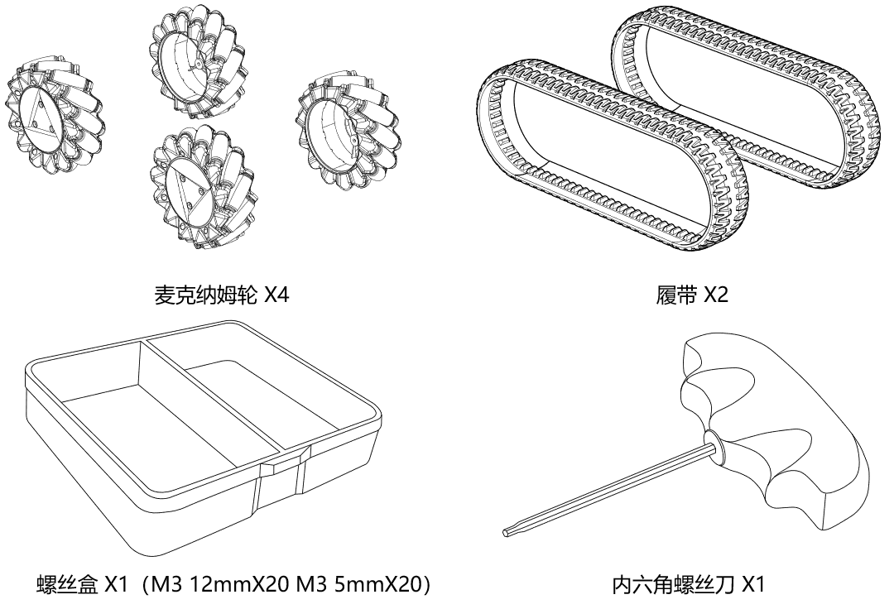

（2）Mycobot机械臂（**选配**）

> **Mycobot机械臂为选配，标准Limo Pro没有搭配机械臂**


### 1.3 性能参数

（1）Limo主体

<table>
	<tr>
		<td>参数类型</td>
		<td>项目</td>
        <td>指标</td>
	</tr>
	<tr>
		<td rowspan="7">机械参数</td>
		<td>外形尺寸</td>
        <td>322*220*251mm</td>
	</tr>
	<tr>
		<td>轴距</td>
        <td>200mm</td>
	</tr>
    	<tr>
		<td>轮距</td>
        <td>175mm</td>
	</tr>
    	<tr>
		<td>自重</td>
        <td>4.8kg</td>
	</tr>
    	<tr>
		<td>负载</td>
        <td>4kg</td>
	</tr>
    	<tr>
		<td>最小离地间隙</td>
            <td>24mm</td>
	</tr>
    	<tr>
		<td>驱动方式</td>
            <td>轮毂电机(4x14.4W)</td>
	</tr>
<tr>
		<td rowspan="4">性能参数</td>
		<td>空载最高车速</td>
        <td>1m/s</td>
	</tr>
<tr>
		<td>阿克曼最小转弯半径</td>
        <td>0.4m</td>
	</tr>
<tr>
		<td>工作环境</td>
        <td>-10~+40℃</td>
	</tr>
<tr>
		<td>最大爬坡角度</td>
        <td>20°</td>
	</tr>
	<td rowspan="11">系统参数</td>
		<td>电源接口</td>
        <td>DC（5.5x2.1mm)</td>
	</tr>
    	<tr>
		<td>工控机</td>
        <td>jetson orin nano</td>
	</tr>
	<tr>
		<td>系统</td>
        <td>Ubuntu20.04</td>
	</tr>
    	<tr>
		<td>IMU</td>
        <td>HI226</td>
	</tr>
    	<tr>
		<td>CPU</td>
        <td>6核 Arm® Cortex®-A78AE</td>
	</tr>
    	<tr>
	</tr>
    	<tr>
		<td>GPU</td>
        <td>1024个CUDA核心</td>
	</tr>
    	<tr>
		<td>电池</td>
            <td>10Ah 12V</td>
	</tr>
    	<tr>
		<td>工作时间</td>
            <td>2.5H</td>
	</tr>
    	<tr>
		<td>待机时间</td>
            <td>4h</td>
	</tr>
    	<tr>
		<td>通讯接口</td>
            <td>WIFI、蓝牙</td>
	</tr>
	<td rowspan="5">传感器</td>
		<td>激光雷达</td>
        <td>EAI T-mini Pro</td>
	</tr>
	<tr>
		<td>深度相机</td>
        <td>奥比中光 DaBai</td>
	</tr>
    	<tr>
		<td>USB-HUB </td>
            <td>TYPE-C x1、USB2.0 x2、HDMI</td>
	</tr>
    	<tr>
		<td>前显示器</td>
            <td>1.54寸128x64白色OLED显示屏</td>
	</tr>
    	<tr>
		<td>后显示器</td>
            <td>7寸1024x600 IPS触控屏</td>
	</tr>
	<td rowspan="2">控制参数</td>
		<td>控制模式</td>
        <td>手机APP、指令控制</td>
	</tr>
	<tr>
		<td>手机APP</td>
        <td>蓝牙/极限距离10m</td>
	</tr>
</table>
（2）Mycobot机械臂（**选配**）

> **Mycobot机械臂为选配，标准Limo Pro没有搭配机械臂**

|     指标     |  参数   |
| :----------: | :-----: |
|    自由度    |    6    |
|   有效负载   |  250g   |
|   工作半径   |  280mm  |
| 重复定位精度 | ±0.5mm  |
|     重量     |  800g   |
|   电源输入   | 12V，5A |
|   工作温度   | -5-45℃  |
|     通信     | Type-C  |


### 1.4 Nvidia Jetson Orin Nano介绍

Jetson Orin Nano是一款基于英伟达（NVIDIA）Orin芯片的嵌入式AI计算机。它是英伟达Jetson系列产品的一员，旨在为开发人员和制造商提供高性能、低功耗的AI计算平台。Jetson Orin Nano是一款小型、低功耗的计算机，被广泛应用于智能监控、机器人、自动驾驶等领域。搭载在limo pro版本，可以用于拓展机器人导航定位、图像处理、语音识别等技术的拓展。

| 名称     | 参数                                                         |
| -------- | ------------------------------------------------------------ |
| GPU      | 1024-core NVIDIA Ampere architecture GPU with 32 tensor cores |
| CPU      | 6-core Arm Cortex-A78AE v8.2                                 |
| 内存     | 8GB 128-bit LPDDR5                                           |
| 存储     | Nvme 128G                                                    |
| 视频编码 | 1080p30 supported by 1-2 CPU cores                           |
| 视频解码 | 1x 4K60 (H.265) 2x 4K30 (H.265) 5x 1080p60 (H.265) 11x 1080p30 (H.265) |
| 摄像头   | Up to 4 cameras 8 lanes MIPI CSI-2 D-PHY 2.1                 |
| 联网     | 千兆以太网，M.2 Key E 接口外扩                               |
| 显示     | DP X 1                                                       |
| USB      | 4x USB 3.2 Gen2                                              |
| 扩展接口 | 3x UART, 2x SPI, 2x I2S, 4x I2C, 1x CAN, DMIC & DSPK, PWM, GPIOs |

### 1.6 MyCobot280 M5 机械臂介绍（选配）

> **Mycobot机械臂为选配，标准Limo Pro没有搭配机械臂**

MyCobot 可根据用户的需求进行二次开发，实现用户个性化定制，是生产力工具也是想象力边界的拓展工具。MyCobot 自重800g，有效载荷250g，有效工作半径280mm；体积小巧但功能强大，可搭配多种末端执行器适配多种应用场景，支持多平台软件的二次开发，满足科研教育、智能家居，商业探索等各种场景需求。

|   项目    |                             参数                             |
| :-------: | :----------------------------------------------------------: |
| 核心参数  | 240MHz dual core. 600DMIPS, 520KB SRAM. Wi-Fi, dual mode Bluetooth |
| 核心Flash |                             4MB                              |
|  核心IO   |                 G19、G21、G22、G23、G25、G33                 |
| 核心蓝牙  |                           2.4G/5G                            |
| 核心无线  |                       2.4G 3D Antenna                        |
| 核心型号  |                      M5Stack-basic/Atom                      |

### 1.7 部件名称

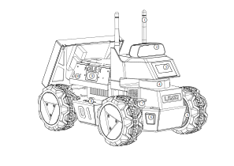

①　WIFI/蓝牙天线；

②　深度相机；

③　前显示器；

④　EAI Tmini PRO激光雷达;

⑤　轮毂电机；

⑥　RGB车灯；

⑦　四轮差速/阿克曼模式切换插销；

⑧　电量显示；

⑨　左扬声器；

⑩　左海鸥门；


⑪　后显示器；

⑫　电池门；

⑬　开关；

⑭　右海鸥门；

⑮　右扬声器；

 

⑯　USB-HUB模块；

 

⑰　语音模块；

⑱　工控机NVIDIA Jetson Nano（4G）；

⑲　电池；

### 1.8 功能亮点

（1）使用四个轮毂电机，节省车体内部空间，可在一个车体上实现阿克曼、四轮差速、履带和麦轮这四种模态的快速切换；


①阿克曼模式：

一种为了解决交通工具转弯时，内外转向轮路径指向的圆心不同的几何学，依据阿克曼转向几何设计的车辆，沿着弯道转弯时，利用四连杆的相等曲柄使内侧轮的转向角比外侧轮大大约2~4度，使四个轮子路径的圆心大致上交会于后轴的延长线上瞬时转向中心，让车辆可以顺畅的转弯。

 

②四轮差速模式：

四轮驱动，可实现原地自转，但对轮胎磨损严重，请勿长时间原地自转；

 

③履带模式：

具有良好的越野性能，可上40°坡和小台阶；

 

④麦克纳姆轮模式：

基于麦克纳姆轮技术的全方位运动设备可以实现前行、横移、斜行、旋转及其组合等运动方式。


（2）车灯状态指示：

两车灯为RGB LED，选用5种对比度高的颜色作为指示灯，其余颜色可供开发者自定义；

| 颜色     | 状态              |
| -------- | ----------------- |
| 红色闪烁 | 低电量/主控报警   |
| 红色常亮 | 程序暂停          |
| 绿色     | 阿克曼模式        |
| 黄色     | 四轮差速/履带模式 |
| 蓝色     | 麦克纳姆轮模式    |

（3）两侧车门可展开，预留一个TYPE-C口和两个USB2.0口，方便调试；


（4）电池可拆换；

 

（5）预留丰富的拓展孔位：

车顶预留8个M3螺丝孔位，以及两条3.2mm宽的槽口；


两车门预留4个M3螺丝孔位，水平展开获得更大安装平台；


车底前后各预留四个M3螺丝孔位；

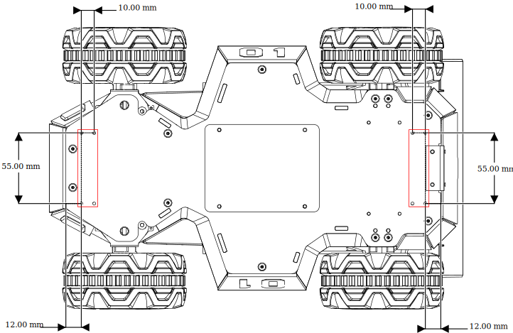 

（6）丰富的交互体验：

摄像头、激光雷达、语音模块、双扬声器配合前显示器可提供丰富的交互体验。


### 1.9 模态切换方法

（1）切换阿克曼模式：

先将两侧插销拔起，顺时针转30度，使两插销上较长的线指向车体正前方 ，即可卡住，车灯变为绿色且常亮时，则切换成功；


（2）切换四轮差速模式：

  拔起来顺时针转30度，使两插销上较短的线指向车体正前方，此时为插入状态，微调轮胎角度对准孔位让插销插入，车灯变为黄色且常亮时，则切换成功；

 


（3）切换履带模式：

在四轮差速模式下将履带直接套上，建议先套空间较小的后轮，并且履带模式下请将两侧车门抬起防止剐蹭；

 

（4）切换麦轮模式：

先将轮毂盖和轮胎拆下，只保留轮毂电机，然后保证每个麦轮的小滚子朝向车体中心，用包装里的M3*5螺丝将麦轮安装上，最后需要用遥控/APP调整至麦轮模式。

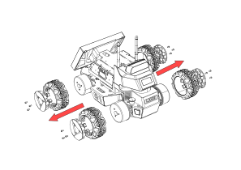 

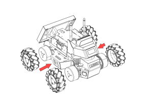

 

**注：切换至麦轮模式的时候，请确保每个麦轮安装的角度如上图所示**

### 1.9 操作说明

（1）长按开关键开机（短按暂停程序），观察电量表，最后一颗红灯量时请及时充电或更换电池；


（2）观察前面插销状态以及车灯颜色判断当前模式：


<table>
<tr>
	<td>插销状态</td>
	<td>车灯颜色</td>
	<td>当前模式</td>
</tr>
	<tr>
        <td rowspan="2"> 插入</td> 
        <td>黄色</td>
        <td>四轮差速/履带模式</td>
    </tr>
    <tr>
        <td>蓝色</td>
        <td>麦克纳姆轮模式</td>
    </tr>
<tr>
	<td>拔起</td>
	<td>绿色</td>
	<td>阿克曼</td>
</tr>
</table>

（3）遥控器说明

遥控准备：右滑开机键开机，将SWB通道拨到中间即可遥控控制，下方为指令控制，上方关闭控制；

 

 

差速模式：将SWD通道拨到中下档位为四轮差速模式，左摇杆控制前进后退，右摇杆控制原地左右转；

 

 

履带模式：与四轮差速模式的运动模型一样；

 

 

麦轮模式：SWD通道在上档位时为麦克纳姆轮模式，左摇杆控制运动方向，右摇杆控制左右原地转；

 

阿克曼模式：在车体上切换为阿克曼模式，开启遥控器控制即可，左摇杆控制前进后退，右摇杆控制左右方向；

 

（4）APP遥控说明

1、 首先在手机上下载我司提供的APP--Nexus，下载方式如下：

IOS端下载：在AppStore搜索Nexus并下载

Android端扫描下面二维码：

 

下载链接：https://www.pgyer.com/CjOI

2、下载App成功后，打开App,如图1-1所示，连接LIMO_xxxxxx的蓝牙；安卓手机点击左上的的蓝牙图标进入蓝牙扫描界面  

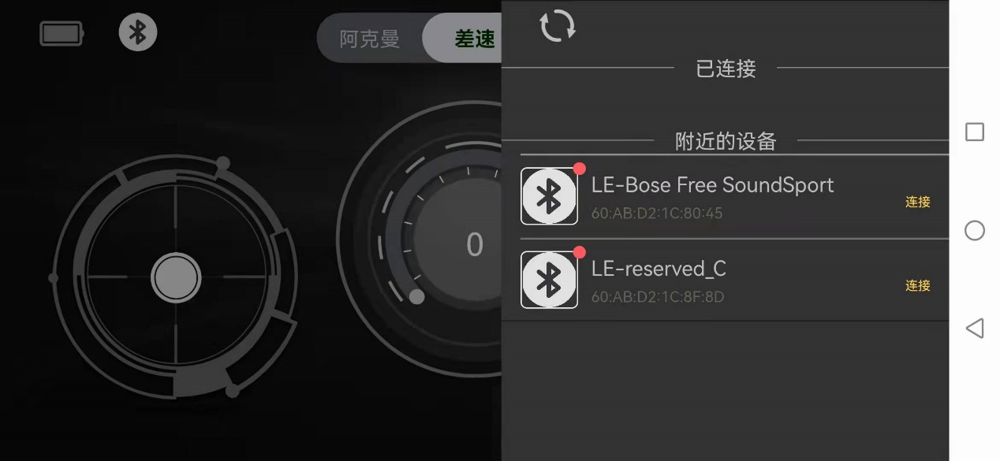 

3、遥控limo


左边控制杆：控制limo前进后退

右边控制杆：控制limo左转右转

中间进度条：速度值显示

模式切换：总共有三种模式，阿克曼运动模式：ackermann，四轮差速运动模式：4wd，麦克纳姆运动模式：mailun

 ackerMann：需要手动将LIMO小车切换阿克曼模式，主要用于校准零点、控制前进后退以及转动角度；

4wd：需要手动将LIMO小车切换四轮差速模式，主要控制前进后退、转换方向以及原地旋转；

Mailun：需要手动将LIMO小车切换麦轮模式，主要控制前进后退、转换方向以及原地旋转

4、APP设置说明


Language switch：通过点击右边的按钮 English/简体，来切换英语和中文

Left-romte min speed：设置LIMO小车的最小速度

Left-romte max speed：设置LIMO小车的最大速度

right-romte min speed：设置LIMO小车的最小旋转速度

right-romte max speed：设置LIMO小车的最大旋转速度

veer calibration：设置零点矫正，先点击+号，然后点击确定Verify，当校准成功会弹出提醒框Successful calibration

BlueTooth：点击弹出蓝牙扫描界面

Bluetooth management：点击random 生成任意以LIMO_xxxx的命名的名字，确认OK并同步修改小车蓝牙的名字，注意此时蓝牙会断开，并会提醒重新连接蓝牙，重新连接蓝牙后可以继续控制小车；当app再次启动，小车的蓝牙名字已经显示修改成功的状态

### 1.10 远程桌面连接

#### 1.10.1 下载安装NoMachine

首先在个人电脑下载相应的软件，下载链接：https://www.nomachine.com/download，根据自己电脑的操作系统和架构下载相应的版本。让limo和电脑连接到同一个WIFI下。                         

#### 1.10.2 连接wifi

打开limo右侧的海鸥门，找到USB-HUB模块，给limo连接上键盘鼠标，USB-HUB模块的位置如下图：


键盘鼠标成功连接之后通过以下操作连接wifi，选择需要连接的wifi。


输入wifi的密码


#### 1.10.2 远程连接limo

选择连接对象

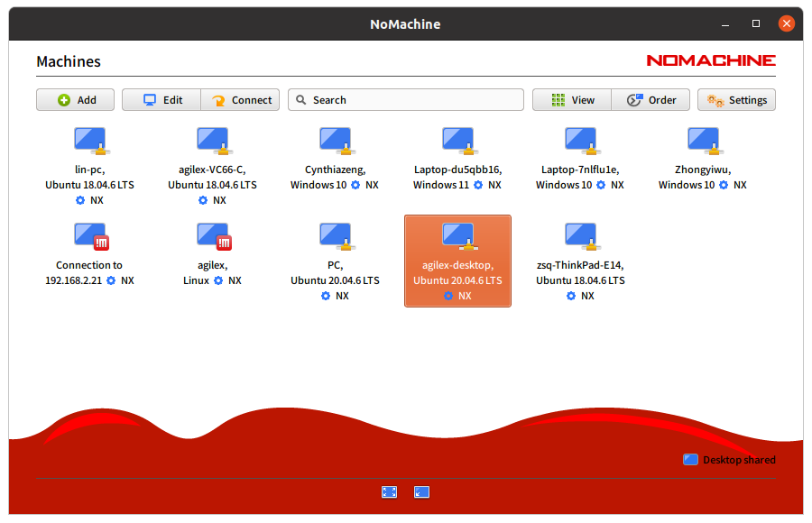

点击Yes


Username：agilex   Password：agx 勾选保存密码


一路选择默认OK


## 二、底盘电气信息说明

###  2.1 电池与充电

#### 2.1.1 电池基本信息

 LIMO随车配备一个12V的电池，该电池有两个接口。分别为黄色的电池输出接口和黑色的电池充电接口。

该电池参数如下表

| 项目         | 额定参数 |
| ------------ | -------- |
| 典型容量     | 10AH     |
| 最小容量     | 10AH     |
| 标称电压     | 11.1V    |
| 充电截至电压 | 12.6V    |
| 放电截至电压 | 8.25V    |

##### 电池注意事项

------

- 为了保证运输存储安全，LIMO配备的电池并不一定处于满电状态 。
- 请不要在电池使用殆尽以后再进行充电，当 LIMO提示电量低时，请及时充电。
- LIMO在关机状态下仍会产生静态待机电流，为防止电池过放，长时间不使用LIMO时请断开电池与车体的连接。
- 请勿将电池投火中，或对电池加热，请勿在高温下存储电池，电池存储的最佳温度为-10℃~40℃。
- 必须使用原厂配备或认证的电池为LIMO供电。

------

####  2.1.2 充电

LIMO默认随车配备一个12.6V 5A的充电器，可满足客户的充电需求，且充电器上设有指示灯可显示充电状态。

------

- 充电时请关机取出电池，将电池输出接口与车体分离。
- 将充电器的充电接头与电池连接，再接通充电器电源进行充电。
- 充满时请先将电池与充电器分离，再断开充电器电源。

------

充电器状态如下表：

| 充电器指示灯颜色 | 电池状态 |
| ---------------- | -------- |
| 红色             | 充电中   |
| 绿色闪烁         | 即将充满 |
| 绿色             | 已充满   |

##### 充电注意事项：

------

- 禁止使用非原装充电器对电池进行充电，请勿在0℃以下给电池充电。
- 充电时必须将电池与LIMO车体分离，禁止在电池充电的同时为LIMO进行供电。
- 当充电器指示灯变为绿色时表示充电完毕，但为了延长电池寿命，充电器会以0.1A的电流进行涓流充电，持续约0.5小时。
- 当前电池从8.25V到充满电状态大约需要2.5小时，电池充满电电压约为12.6V。

### 2.2 使用环境及安全注意事项

------

- LIMO的工作温度为-10℃ ~ 40℃，请勿在温度低于-10℃、高于40℃环境中使用；
- LIMO的使用环境的相对湿度要求是：最大80%，最小30%；
- 请勿在存在腐蚀性、易燃性气体的环境或者靠近可燃性物质的环境中使用；
- LIMO不具有防水功能，请勿在有雨、雪、积水的环境使用；
- 建议使用环境海拔高度不超过1000米、昼夜温差不超过25℃；
- 使用过程有疑问，请按照相关说明手册进行操作或者咨询相关技术人员
- 请不要推动limo，防止逆向发电损坏limo主板及电池；
- 请勿未经技术支持和允许，私自改装内部设备结构。

### 2.3 供电拓扑


------

- LIMO的电池能提供最大10A的电流给底盘、Nano及传感器等系统供电，当系统检测到工作电流大于10A时，为了保护电池和电机会进入过流保护模式。

- USB HUB 的三个USB接口合计输出电流最大为0.5A。

### 2.4 通信拓扑

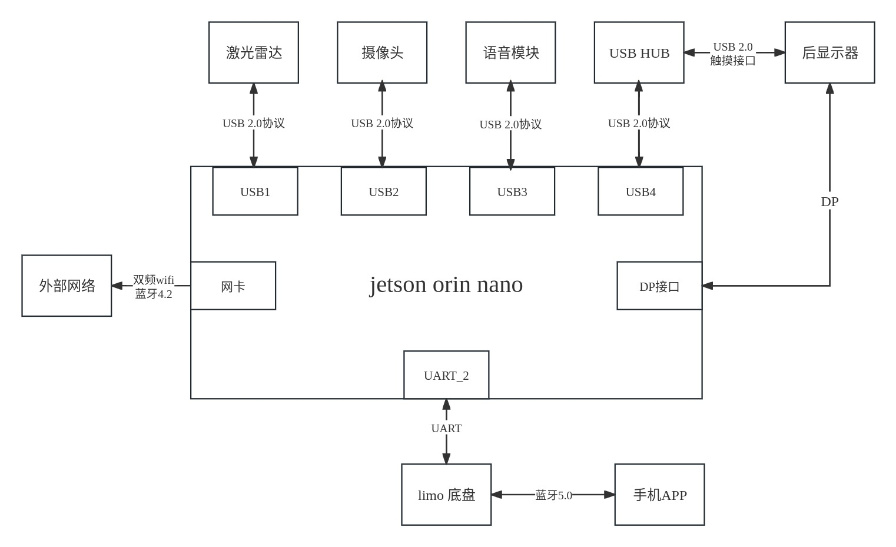

------

- LIMO底盘内置了蓝牙5.0模块可以与手机端的APP连接，实现遥控功能。
- LIMO与Nano通过UART接口直接连接，Nano通过该接口可实现对底盘的控制。
- USB HUB提供2个USB和1个Type C接口，3个接口均工作在USB2.0协议下。
- 后显示屏通过USB2.0接口与USB HUB相连，起触摸功能。

## 三、底盘驱动程序驱动

> **特殊说明，由于Limo Pro 是ROS1 Noetic 和 ROS Foxy并存的，所以每次打开一个新终端时需要选择使用ROS1或是ROS2**
>
> **打开终端，输入2，回车确定，选择ROS2 Foxy，在终端中输入命令：**


移动底盘需要通过程序驱动才能实现limo的导航，limo的底盘驱动程序分为两个版本，分别为C++版本和Python版本，两个版本都可以控制limo运动。

### 3.1 C++底盘驱动

C++版本的驱动程序所在文件夹为~/agilex_ws/src/limo_ros/limo_base，可以通过以下命令进入到该文件夹中

```
cd agilex_ws/src/limo_ros/limo_base
```

以下是limo_base功能包的文件列表：

```
├── limo_base
    ├── CMakeLists.txt
    ├── include
    │   ├── limo_driver.h
    │   ├── limo_protocol.h
    │   └── serial_port.h
    ├── launch
    │   └── limo_base.launch
    ├── msg
    │   └── LimoStatus.msg
    ├── package.xml
    └── src
        ├── limo_base_node.cpp
        ├── limo_driver.cpp
        └── serial_port.cpp
```

limo_base下有四个文件夹，分别为include、launch、msg、src。include文件夹下存放着驱动程序所调用的库文件；launch文件夹下存放着驱动程序的启动文件；msg文件夹下存放着驱动程序所需要的消息文件；src文件夹下存放着驱动程序源代码。

| 文件夹  | 存放文件                 |
| ------- | ------------------------ |
| include | 驱动程序所调用的库文件   |
| launch  | 驱动程序的启动文件       |
| msg     | 驱动程序所需要的消息文件 |
| src     | 驱动程序源代码           |

可以通过一段简单的指令控制limo向前运动

注：在运行命令之前，请确保其他终端中的程序已经终止，终止命令为：Ctrl+c

1、启动底盘，打开一个终端，在终端中输入命令：

```
ros2 launch limo_base limo_base.launch.py
```

2、输入控制指令，打开一个终端，在终端中输入命令：

```
ros2 topic pub /cmd_vel geometry_msgs/msg/Twist "linear:
  x: 0.1
  y: 0.0
  z: 0.0
angular:
  x: 0.0
  y: 0.0
  z: 0.0" 
```

注：整个命令复制到终端中输入即可，不要手动输入

在终端输入命令之后，limo会先前行走一小段距离，然后停下。

驱动程序源码中使用到的函数：

| 函数名称                     | 函数作用                     |
| ---------------------------- | ---------------------------- |
| connect()                    | 连接底盘                     |
| readData()                   | 读取数据，获取底盘反馈的信息 |
| processRxData()              | 接收串口数据                 |
| parseFrame()                 | 处理串口数据                 |
| sendFrame()                  | 发送串口数据                 |
| setMotionCommand()           | 设置limo的控制模式           |
| enableCommandedMode()        | 使能控制模式                 |
| publishOdometry()            | 发布里程计数据               |
| publishLimoState()           | 发布limo的状态信息           |
| publishIMUData()             | 发布IMU的数据                |
| processErrorCode()           | 错误检测                     |
| twistCmdCallback()           | 发布速度控制数据             |
| normalizeAngle()             | 输出一个正常的角度           |
| degToRad()                   | 把角度转成弧度               |
| convertInnerAngleToCentral() | 将内角转换为中心角           |
| convertCentralAngleToInner() | 将中心角转换为内角           |

### 3.2 Python底盘驱动

limo的Python版本驱动上传到pypi，可以通过pip指令下载该驱动程序；程序的安装目录为~/.local/lib/python3.6/site-packages/pylimo。它的文件列表为：

```
├── __init__.py
├── limomsg.py	
├── limo.py	
└── __pycache__
    ├── __init__.cpython-36.pyc
    ├── limo.cpython-36.pyc
    └── limomsg.cpython-36.pyc
```

Python版本的代码比较简洁，仅有三个文件组成驱动程序，init.py的作用为申明需要使用的文件， limomsg.py的作用为驱动成所需要的消息，limo.py是主程序，它的作用是驱动limo。

| 文件名称   | 文件作用             |
| ---------- | -------------------- |
| init.py    | 申明需要使用的文件   |
| limomsg.py | 驱动成所需要的消息   |
| limo.py    | 主程序，用于驱动limo |

我们提供了一个脚本调用该驱动程序，该脚本所在目录为agilex_ws/src/limo_ros/limo_base/script，脚本名称为limomove.py。

可以通过以下命令访问此目录，输入2，回车确定，选择ROS2 Foxy，在终端中输入命令：

> 注：在运行命令之前，请确保其他终端中的程序已经终止，终止命令为：Ctrl+c
>

```
cd agilex_ws/src/limo_ros/limo_base/script
```

运行脚本

```
python3 limomove.py
```

在终端输入命令之后，limo会先前行走一段距离，然后停下。

驱动程序中所使用的函数名称：

| 函数名称             | 函数作用         |
| -------------------- | ---------------- |
| EnableCommand()      | 控制使能         |
| SetMotionCommand()   | 设置移动命令     |
| GetLinearVelocity()  | 获取线速度       |
| GetAngularVelocity() | 获取角速度       |
| GetSteeringAngle()   | 获取内转角角度   |
| GetLateralVelocity() | 获取横移速度     |
| GetControlMode()     | 获取控制模式     |
| GetBatteryVoltage()  | 获取电池电量     |
| GetErrorCode()       | 获取错误代码     |
| GetRightWheelOdem()  | 获取左轮里程计   |
| GetLeftWheelOdem()   | 获取右轮里程计   |
| GetIMUAccelData()    | 获取IMU的加速度  |
| GetIMUGyroData()     | 获取陀螺仪的数据 |
| GetIMUYawData()      | 获取IMU的航向角  |
| GetIMUPichData()     | 获取俯仰角       |
| GetIMURollData()     | 获取横滚角       |

## 四、底盘运动学分析

> **特殊说明，由于Limo Pro 是ROS1 Noetic 和 ROS Foxy并存的，所以每次打开一个新终端时需要选择使用ROS1或是ROS2**
>
> **打开终端，输入2，回车确定，选择ROS2 Foxy，在终端中输入命令：**


现在移动机器人这么火热，大到无人驾驶车，规矩的有工业上应用得很多的AGV（比如智能物流自动搬运机器人），小到淘宝上面的智能小车，都可以算作移动机器人。移动机器人有各种各样的底盘，有两轮的三轮的四轮的，比如无人车是四轮的阿克曼模型，一般的AGV是两轮差速模型，还有大学生机器人竞赛里面常见的三轮全向轮底盘，四轮全向轮底盘，还有一些AGV是四轮滑移底盘，是不是有点让人眼花缭乱的感觉呢；本节将从运动学方面介绍limo的四种运动模式。

### 4.1 四轮差速运动模式

我们把一台四轮差速运动的机器人简化成下图的模型，其中四个车轮由四个单独的电机驱动，只需要控制四个车轮的速度，就可以达到控制机器人的前进、后退、以及转向的运动效果了。


我们给机器人一个参考坐标系，红色箭头为X正方向，蓝色箭头为Y轴正方向，Z轴沿着原点垂直屏幕向外，坐标原点为机器人的质心，坐标系满足安培右手定则。当四个车轮的速度（大小+方向）一样时，机器人就可以实现前进和后退。当四个车轮的速度不一样时，机器人将会产生转向运动。

一旦机器人产生转向运动，那么意味着有一个转向中心即下图中的点ICR。以左前轮为例，轮子与地面接触点A的相对运动速度方向如图所示，合速度方向与线段A-ICR相互垂直，而轮胎只能沿着纵向分速度方向转动，做速度分解可知，还存在沿轮子轴向（电机轴向）的横向分速度。


由于四个轮胎的横向分速度大小不同，因此机器人会产生旋转分运动，而纵向分速度产生纵向分运动，合成运动则表现为机器人绕ICR做圆周运动。 

在机器人转弯时，两侧的轮胎角速度一样，内侧的轮胎转弯半径小，所以线速度更小，外侧的轮胎转弯半径大，所以外侧线速度更大。即右侧速度大时，将会向左转，同理可知，左侧速度大时，将会向右转。

而且从上图可以看出同侧的轮胎Vx（纵向分速度）一样，上（下）端的轮胎Vy（横向分速度）一样。如果想要绕自身自转的话，只需要左（右）侧的两个车轮速度一样大，且方向相同、右（左）侧的两个车轮速度与另一侧一样，但方向与另一侧相反即可。

我们可以尝试控制四轮差速模式下的limo，首先把limo调整为四轮差速模式，  拔起来顺时针转30度，使两插销上较短的线指向车体正前方，此时为插入状态，微调轮胎角度对准孔位让插销插入，车灯变为黄色则切换成功。

模式切换成功之后，运行以下命令，我们就可以启用键盘或者手柄来控制。

启动底盘节点

```
ros2 launch limo_base limo_base.launch.py 
```

启动键盘控制节点

```
ros2 run teleop_twist_keyboard teleop_twist_keyboard 
```

### 4.2 履带运动模式

履带差速模式下单侧履带可等效视为“无穷多个小轮子”，且这单侧的“无穷多个小轮子”的“转速”是一致的。所以，履带差速模式的转向方式和四轮差速模式的转向方式是一致的，也是滑动转向。

具体来讲，履带差速运动和四轮差速运动均是通过控制两侧履带（或轮子）的相对速度实现，但二者也有区别：履带对地面产生的剪切和压力分布，是不同于轮子的。此区别体现在车轮速度控制上时影响不大。车轮速度不一致时，我们参照可以以下简化后的模型


ICR为运动旋转中心，CENTER为机器人几何学中心，COM为机器人质心。转弯时，内侧履带的速度小于外侧履带的速度，如果想要绕自身自转的话，只需要左（右）侧履带速度一样大，且方向相同、右（左）侧的履带速度与另一侧一样，但方向与另一侧相反即可。

在四轮差速模式下将履带直接套上，建议先套空间较小的后轮，并且履带模式下请将两侧车门抬起防止剐蹭。

更换完成之后，运行以下命令，我们就可以启用键盘或者手柄来控制。

> 注：在运行命令之前，请确保其他终端中的程序已经终止，终止命令为：Ctrl+c

启动底盘节点

```
ros2 launch limo_base limo_base.launch.py
```

启动键盘控制节点

```
ros2 run teleop_twist_keyboard teleop_twist_keyboard 
```

### 4.3 阿克曼运动模式

阿克曼转向结构是现代汽车的转向方式，可以解决汽车在转向时，由于左、右转向轮的转向半径不同所造成的左、右转向轮转角不同的问题。

首先看一下阿克曼运动模态简化之后的模型图。与差速运动相同，如果我们给四个车轮相同的的速度（大小+方向），即可实现机器人的前进和后退。不同之处在于转弯，需要根据前端两个车轮的偏转方向，利用阿克曼转向几何来计算转弯半径。点CENTER为机器人几何中心，点BASE为后杆的中点。此时，机器人将绕ICR做圆周运动，此转弯半径也为最小转弯半径。由图可知，前段两个车轮的偏角并不一致，两个车轮偏角的差值（θA-θB）为阿克曼角。如果机器人在阿克曼运动模式下还是采用四轮驱动的方式，在转弯时，内侧车轮的速度小于外侧车轮。


阿克曼进一步简化，就是平时我们骑得自行车模型，上图橘黄色部分是机器人等效的自行车模型。相比于差速运动模态，阿克曼运动模态有转弯半径的限制，移动机器人不能实现自旋，即转弯半径不能为0。

先将两侧插销拔起，顺时针转30度，使两插销上较长的线指向车体正前方 ，即可卡住，车灯变为绿色则切换成功，limo就变换为阿克曼运动模态了。

模式切换成功之后，运行以下命令，我们就可以启用键盘或者手柄来控制。

切换成功之后，运行以下命令，我们就可以启用键盘或者手柄来控制。

> 注：在运行命令之前，请确保其他终端中的程序已经终止，终止命令为：Ctrl+c

启动底盘节点

```
ros2 launch limo_base limo_base.launch.py
```

启动键盘控制节点

```
ros2 run teleop_twist_keyboard teleop_twist_keyboard 
```

> 注：当在阿克曼模式下走不直时需要进行舵机校准。

### 4.4 麦克纳姆运动模式

麦克纳姆轮是一种特殊的车轮，由轮毂和辊子组成：轮毂是整个轮子的主体支架，辊子则是安装在轮毂上的被动运动的鼓状物（小轮），两者组成一个完整的大轮。市面上轮毂轴线与辊子转轴夹角大致可分30度、45度、60度三种。为满足全向运动的几何关系，轮毂边缘采用了折弯工艺，为辊子的转轴提供安装孔。


假定车轮逆时针转动，对麦克纳姆轮进行受力分析，上图中坐标系红色表示x轴，绿色表示y轴，蓝色表示z轴，辊子坐标系用虚线表示，轮毂坐标系用实线表示；黄色箭头表示麦轮和辊子的受力分析；蓝色箭头表示速度方向。

麦轮外围的辊子是与地面接触的，当麦轮绕轮毂轴转动时，辊子会与地面产生摩擦力Ff，其作用力方向为轮毂坐标系Y轴正方向。对Ff沿着辊子坐标系做正交分解，F1沿辊子Y轴负方向，大小为√2/2Ff，FⅡ沿辊子X轴正方向，大小为√2/2Ff。F1为辊子的滚动摩擦力，对辊子造成磨损，并不能改变轮胎的运动方向，FⅡ会迫使辊子沿X轴正方向运动，故FⅡ为静摩擦，促使辊子相对地面运动。

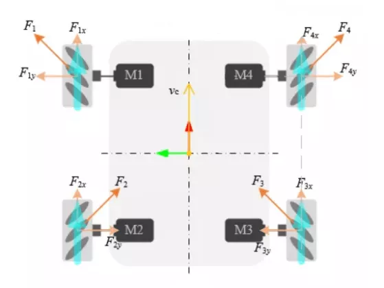

不同的车轮排列方式也需采用不同的控制方式，将麦轮的全向运动简化成上图这个模型，蓝色箭头表示车轮运动方向，橘黄色箭头表示麦轮的受力分析情况。将各力合并，我们将发现移动机器人只有一个向前的力，故此时机器人将向前运动。

结合之前四轮差速运动模式，对各个轮胎的摩擦力进行合并，就可使机器人往任意方向去运动。下面列举一些不同方向运动时轮胎的状态。


先将轮毂盖和轮胎拆下，只保留轮毂电机，然后保证每个麦轮的小滚子朝向车体中心，用包装里的M3*5螺丝将麦轮安装上，遥控操作的时候需要将遥控器/APP调整至麦轮模式。

遥控手柄在四轮差速控制模式下，通道8处于最下档时切换为麦轮控制模式，处于中上档时切回差速模式；

> 注：在运行命令之前，请确保其他终端中的程序已经终止，终止命令为：Ctrl+c

启动底盘节点

```
ros2 launch limo_base limo_base.launch.py
```

启动键盘控制节点

```
ros2 run teleop_twist_keyboard teleop_twist_keyboard 
```

移动机器人的运动模态有很多，每一种都有其优缺点，在实际场景中我们可以根据场景特点和需求，选用最合适的运动模态。下表总结了四种运动模式的优缺点，仅供参看。

| 模态 | 四轮差速                     | 履带                                             | 阿克曼                                         | 麦克纳姆                                           |
| ---- | ---------------------------- | ------------------------------------------------ | ---------------------------------------------- | -------------------------------------------------- |
| 优点 | 运动性能好，控制简单         | 适应性强，具有良好的越野性能，适用于多种复杂场地 | 与汽车的运动模式相同，便于做深入的自动驾驶研究 | 机动性好，可以全向运动                             |
| 缺点 | 转向有滑移，轮胎的磨损比较大 | 滑动转向阻力大，对履带的磨损较大                 | 转弯半径有限，轮胎磨损小                       | 场地要求较高，辊子间不连续，运动时有震动，磨损较大 |


## 五、雷达建图

> **特殊说明，由于Limo Pro 是ROS1 Noetic 和 ROS Foxy并存的，所以每次打开一个新终端时需要选择使用ROS1或是ROS2**
>
> **打开终端，输入2，回车确定，选择ROS2 Foxy，在终端中输入命令：**


### 5.1 雷达介绍和使用

YDLIDAR T-mini Pro 激光雷达是深圳玩智商科技有限公司（EAI）研发的一款 360°2D 激光雷达（以下简称：T-mini Pro）。本产品基于脉冲 ToF 测距原理，并配以相关光学、电 学、算法设计，实现高频高精度的距离测量，同时，机械结构 360 度旋转，不断获取角度信 息，从而实现了 360 度扫描测距，输出扫描环境的点云数据。

| 项目       | 最小值 | 默认值 | 最大值 | 单位 | 备注                                 |
| ---------- | ------ | ------ | ------ | ---- | ------------------------------------ |
| 测距频率   | /      | 4000   | /      | Hz   | 每秒测距 4000 次                     |
| 扫描频率   | 6      | 6      | 12     | Hz   | 需要接入 PWM 信号，推荐 使用转速 6Hz |
| 测距范围   | 0.02   | /      | 12     | m    | 室内环境，80%反射率物体              |
| 扫描角度   | /      | 0-360  | /      | Deg  | /                                    |
| 测距精度   | /      | 20     | /      | mm   | 0.05m <测距≤12m 时                   |
| 俯仰角     | 0      | 0.75   | 1.5    | Deg  | /                                    |
| 角度分辨率 | 0.54   |        |        | Deg  |                                      |

其使用方式如下：

打开一个新的终端，在终端中输入命令：

```
ros2 launch limo_bringup limo_start.launch.py 
```

成功打开之后，终端会输出以下日志信息，如图：

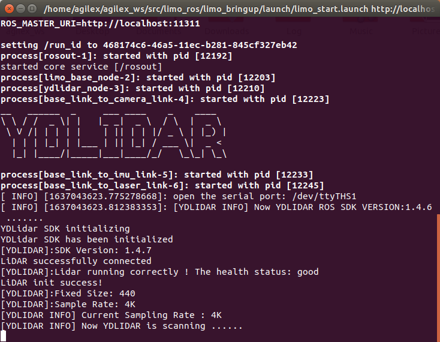

然后新开启一个终端，在终端中输入命令：

```
ros2 launch limo_bringup lidar_rviz.launch.py
```

成功运行之后会看到rviz可视化工具打开，其中显示的绿色数据就是雷达扫描出来的激光数据。


这时候可以把遥控器/App调为遥控模式，遥控小车进行移动，这时会看到激光的数据也会跟着变化。

### 5.2 cartographer建图

#### 5.2.1 cartographer建图算法介绍

cartographer是google推出的一套基于图优化的SLAM算法。该算法的主要目标是实现低计算资源消耗，达到实时SLAM的目的。该算法主要分为两个部分，第一个部分称为Local SLAM, 该部分通过一帧帧的Laser Scan建立并维护一系列的Submap，而所谓的submap就是一系列的Grid Map。算法的第二个部分，称为Global SLAM的部分，就是通过Loop Closure来进行闭环检测，来消除累积误差：当一个submap构建完成，也就是不会再有新的laser scan插入到该submap时，算法会将该submap加入到闭环检测中。

#### 5.2.2 cartographer建图实践操作

> 注：在运行命令之前，请确保其他终端中的程序已经终止，终止命令为：Ctrl+c
>

> 注：建图过程中limo的速度尽量慢点，速度太快会影响建图的效果
>

首先需要启动雷达，打开一个新终端，在终端中输入命令：

```
ros2 launch limo_bringup limo_start.launch.py
```

然后启动cartographer建图算法，打开另一个新终端，在终端中输入命令：

```
ros2 launch limo_bringup cartographer.launch.py 
```

成功启动之后会弹出rviz可视化界面，如下图：

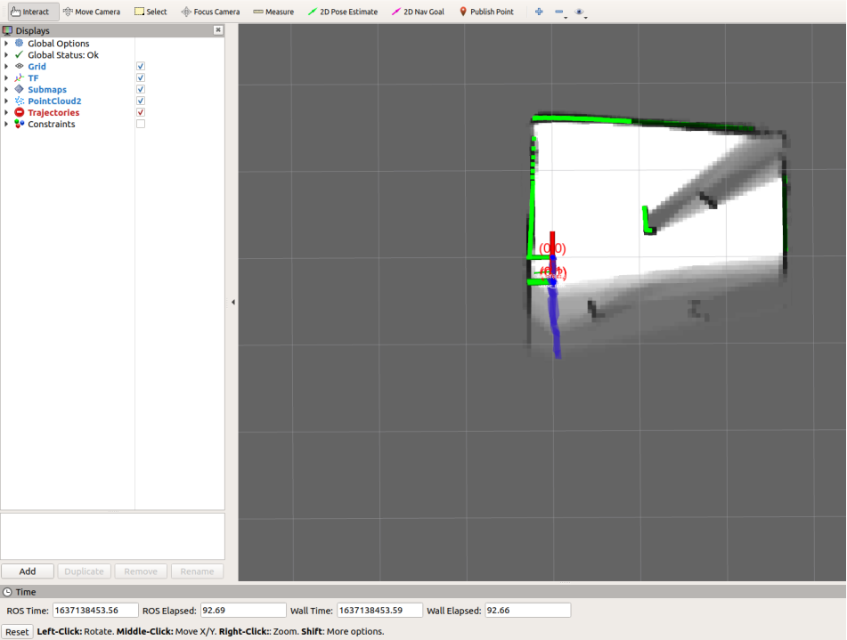

在构建完地图之后需要保存地图，需要在终端中输入以下命令：

（1）进入保存地图的文件

```
cd /home/agilex/limo_ros2_ws/src/limo_ros2/limo_bringup/maps
```

（2）在终端输入保存地图的命令

```
ros2 run nav2_map_server map_saver_cli -f map11
```

##  六、雷达导航

> **特殊说明，由于Limo Pro 是ROS1 Noetic 和 ROS Foxy并存的，所以每次打开一个新终端时需要选择使用ROS1或是ROS2**
>
> **打开终端，输入2，回车确定，选择ROS2 Foxy，在终端中输入命令：**


前面我们使用了两种激光建图方式，接下来利用刚刚构建地图进行导航。

### 6.1 导航框架

导航的关键是机器人定位和路径规划两大部分。针对这两个核心,ROS提供了以下两个功能包。

（1）move_base：实现机器人导航中的最优路径规划。

（2）amcl：实现二维地图中的机器人定位。

在上述的两个功能包的基础上，ROS提供了一套完整的导航框架，


机器人只需要发布必要的传感器信息和导航的目标位置,ROS即可完成导航功能。在该框架中,move_base功能包提供导航的主要运行、交互接口。为了保障导航路径的准确性,机器人还要对自己所处的位置进行精确定位,这部分功能由amcl功能包实现。

#### 6.1.1 move_base 功能包

move_base是ROS中完成路径规划的功能包,主要由以下两大规划器组成。

全局路径规划(global_planner)。全局路径规划是根据给定的目标位置和全局地图进行总体路径的规划。在导航中,使用Dijkstra或A*算法进行全局路径的规划,计算出机器人到目标位置的最优路线,作为机器人的全局路线。

本地实时规划(local_planner)。在实际情况中,机器人往往无法严格按照全局路线行驶,所以需要针对地图信息和机器人附近随时可能出现的障碍物规划机器人每个周期内应该行驶的路线,使之尽量符合全局最优路径。

#### 6.1.2 amcl 功能包

自主定位即机器人在任意状态下都可以推算出自己在地图中所处的位置。ROS为开发者提供了一种自适应(或kld采样)的蒙特卡罗定位方法(amcl), 这是一种概率定位系统，以2D方式对移动机器人定位。 它实现了自适应（或者KLD-采样）蒙特卡洛定位法，使用粒子滤波跟踪机器人在已知地图中的位姿。

#### 6.1.3 DWA_planner和TEB_planner介绍

DWA_planner

DWA 的全称为DynamicWindow Approaches，该算法可以搜索躲避和行进的多条路经,综合各评价标准(是否会撞击障碍物,所需要的时间等)选取最优路径,并且计算行驶周期内的线速度和角速度,避免与动态出现的障碍物发生碰撞。

TEB_planner

“TEB”全称Time Elastic Band（时间弹性带）Local Planner，该方法针对全局路径规划器生成的初始轨迹进行后续修正(modification)，从而优化机器人的运动轨迹，属于局部路径规划。在轨迹优化过程中，该算法拥有多种优化目标，包括但不限于：整体路径长度、轨迹运行时间、与障碍物的距离、通过中间路径点以及机器人动力学、运动学以及几何约束的符合性。“TEB方法”明确考虑了运动状态下时空方面的动态约束，如机器人的速度和加速度是有限制的。

### 6.2 limo导航功能

> 注：四轮差速模式和全向轮模式、履带模式下，导航运行的文件一样
>

> 注：在运行命令之前，请确保其他终端中的程序已经终止，终止命令为：Ctrl+c
>

（1）首先启动雷达，在终端中输入命令：

```
ros2 launch limo_bringup limo_start.launch.py
```

（2）修改启动文件，在终端中输入命令，打开文件；将map11修改为刚刚保存的地图文件名

```
gedit /home/agilex/limo_ros2_ws/src/limo_ros2/limo_bringup/launch/limo_nav2.launch.py
```

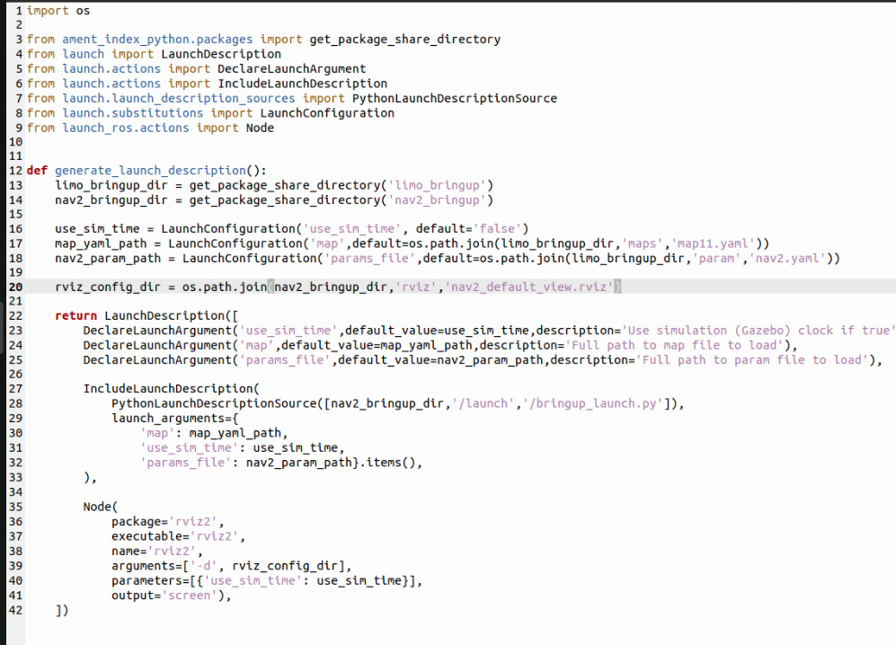

修改之后，进入到文件夹/home/agilex/limo_ros2_ws；并编译代码

```
cd /home/agilex/limo_ros2_ws
```

```
colcon build 
```

（3）启动导航功能，在终端中输入命令：

```
ros2 launch limo_bringup limo_nav2.launch.py 
```

> 注：如果是阿克曼运动模式，请运行
>

```
ros2 launch limo_bringup limo_nav2_ackmann.launch.py 
```

启动成功之后会打开rviz界面，如图 ：


（3）开启导航之后，会发现激光扫描出来的形状和地图没有重合，需要我们手动校正，在rviz中显示的地图上矫正底盘在场景中实际的位置，通过rviz中的工具，发布一个大概的位置，给limo一个大致的位置，然后通过手柄遥控limo旋转，让其自动校正，当激光形状和地图中的场景形状重叠的时候，校正完成。操作步骤如图 ：


校正完成后


（4）通过2D Nav Goal 设置导航目标点。


地图中将会生成一条紫色的路径，手机切换至指令模式，limo将自动导航到目标点。

（5）多点导航功能

点击红色框中的按钮，进入多点导航模式


点击Nav2 Goal，在地图上打点，给完点之后，点击红框中的按钮，开始导航。


##  七、深度相机+雷达建图

> **特殊说明，由于Limo Pro 是ROS1 Noetic 和 ROS Foxy并存的，所以每次打开一个新终端时需要选择使用ROS1或是ROS2**
>
> **打开终端，输入2，回车确定，选择ROS2 Foxy，在终端中输入命令：**


### 7.1 ORBBEC®Dabai的介绍与使用

ORBBEC®Dabai 是基于双目结构光 3D 成像技术的深度相机，主要包括左红外相机(IR camera1)、右红外相机(IR camera2)、一个红外投影仪(IR projector)以及深度计算处理器(depth processor)。红外投影仪用于向目标场景(Scene)投射结构光图案(散斑图案)，左红外相机以及或红外相机分别采集目标的左红外结构光图像以及右红外结构光图像，深度计算处理器接收左红外结构光图像、右红外结构光图像后执行深度计算算法并输出目标场景的深度图像。

| 参数名称                         | 参数指标                                                     |
| -------------------------------- | ------------------------------------------------------------ |
| 左、右红外相机成像中心之间的距离 | 40mm                                                         |
| 深度距离                         | 0.3-3m                                                       |
| 功耗                             | 整机工作平均功耗<2W,<br/>激光开启瞬间峰值 <5W(持续时间 3ms),<br/>待机功耗典型值为<0.7W |
| 深度图分辨率                     | 640*400@30FPS<br/>320*200@30FPS                              |
| 彩色图分辨率                     | 1920X1080@30FPS<br/>1280X720@30FPS<br/>640X480@30FPS         |
| 精度                             | 6mm@1m(81%FOV区域参与精度计算*)                              |
| 深度 FOV                         | H 67.9° V 45.3°                                              |
| 彩色 FOV                         | H 71° V43.7° @1920X1080                                      |
| 延迟                             | 30-45ms                                                      |
| 数据传输                         | USB2.0 或以上                                                |
| 支持操作系统                     | Android / Linux / Windows7/10                                |
| 供电方式                         | USB                                                          |
| 工作温度                         | 10°C ~ 40°C                                                  |
| 适用场景                         | 室内 / 室外(具体以应用场景和相关算法要求为准)                |
| 防尘防水                         | 基础防尘                                                     |
| 安全性                           | Class1 激光                                                  |
| 尺寸(毫米)                       | 长59.6X宽17.4X厚11.1mm                                       |

了解ORBBEC®Dabai的基本参数之后，开始实践操作

> 注：在运行命令之前，请确保其他终端中的程序已经终止，终止命令为：Ctrl+c 
>

首先启动ORBBEC®Dabai摄像头，运行下面的命令：

```
ros2 launch orbbec_camera dabai.launch.py
```

运行过程中会出现以下警告，这是由于驱动中的一些参数摄像头不支持，可以忽略。

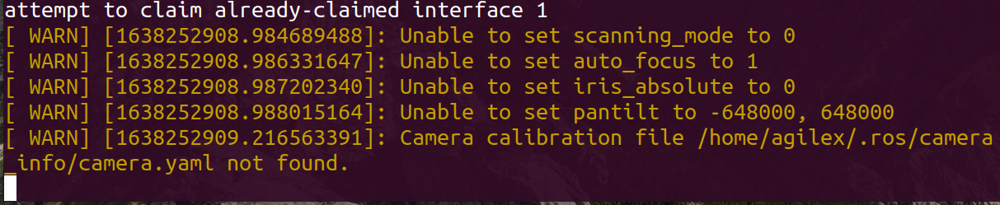

### 7.3 查看深度相机信息

成功打开深度相机之后，接下来启动rviz，查看深度相机所拍摄到的图像和采集的深度信息。

开启一个新终端，输入命令：

```
rviz2
```

打开rqt_image_view：

```
ros2 run rqt_image_view rqt_image_view
```


### 7.2 rtabmap算法介绍

RTAB-Map（Real-Time Appearance-Based Mapping）是一种用于同时定位与地图构建（SLAM）的算法，旨在在实时性能和地图质量之间取得平衡。RTAB-Map是基于图的SLAM系统，能够在运行时（real-time）构建稠密的3D地图。

以下是RTAB-Map的一些关键特点和组成部分：

1. **实时性能：** RTAB-Map致力于在实时应用中运行，如机器人导航或增强现实系统。其算法设计旨在最大程度地减小计算负担，以便在有限的计算资源下实现快速而准确的地图构建和定位。
2. **基于特征的SLAM：** RTAB-Map使用视觉和惯性传感器数据，通过提取关键点和描述子进行特征匹配，以便在连续的帧之间进行定位和地图构建。这使得它能够在缺乏精确运动模型的情况下执行SLAM。
3. **环境感知：** RTAB-Map通过环境感知（如深度信息、视差等）增强地图的质量。这对于处理具有纹理较少或存在重复结构的环境非常有用。
4. **循环检测和闭环优化：** RTAB-Map通过循环检测来识别之前访问过的地图区域，然后通过优化技术来校正先前的轨迹和地图。这有助于减小误差并提高地图的一致性。
5. **RGB-D传感器支持：** RTAB-Map直接支持RGB-D传感器，如Microsoft Kinect，以获取深度信息，从而提高地图的准确性和稠密程度。

### 7.3 rtabmap算法建图

> 注：在运行命令之前，请确保其他终端中的程序已经终止，终止命令为：Ctrl+c
>

> 注：建图过程中limo的速度尽量慢点，速度太快会影响建图的效果
>

（1）启动雷达，在终端中输入命令：

```
ros2 launch limo_bringup limo_start.launch.py
```

（2）启动相机，在终端中输入命令：

```
ros2 launch orbbec_camera dabai.launch.py
```

（3）启动rtabmap算法的建图模式，在终端中输入命令：

```
ros2 launch limo_bringup limo_rtab_slam.launch.py
```

当构建完地图之后，可以直接终止程序，构建的地图将自动保存在主目录下的.ros文件中，文件名称为rtabmap.db。.ros文件夹为隐藏文件夹，需要通过Ctrl+h指令显示出来。


7.4 rtabmap算法导航

> 注：在运行命令之前，请确保其他终端中的程序已经终止，终止命令为：Ctrl+c
>

（1）启动雷达，在终端中输入命令：

```
ros2 launch limo_bringup limo_start.launch.py
```

（2）启动相机，在终端中输入命令：

```
ros2 launch orbbec_camera dabai.launch.py
```

（3）启动rtabmap算法的建图模式，在终端中输入命令：

```
ros2 launch limo_bringup limo_rtab_rgbd.launch.py localization:=true
```

（4）启动导航算法，在终端中输入命令：

```
ros2 launch limo_bringup limo_rtab_nav2.launch.py 
```


（5）因为我们用到视觉定位，所以在采用rtabmap导航的时候不需要校正，可以直接开始设置目标点进行导航，操作步骤如图 。


地图中将会生成一条绿色的路径，将limo切换至指令模式，limo将自动导航到目标点

## 八、 视觉模块

> **特殊说明，由于Limo Pro 是ROS1 Noetic 和 ROS Foxy并存的，所以每次打开一个新终端时需要选择使用ROS1或是ROS2**
>
> **打开终端，输入2，回车确定，选择ROS2 Foxy，在终端中输入命令：**


### 8.1 颜色识别

#### 8.1.1 功能简介

在ROS中使用OpenCV进行颜色识别的思路是，使用cv_bridge将ROS图像消息转换为OpenCV格式，然后在图像上应用颜色阈值过滤，提取感兴趣的颜色范围。标记检测结果，例如通过绘制边界框，然后将结果发布到新的ROS话题，以供其他节点使用。该过程包括图像的获取、颜色空间转换、阈值处理和结果发布，使机器人能够实时识别目标颜色区域。

#### 8.1.2 运行功能

> 注：在运行命令之前，请确保其他终端中的程序已经终止，终止命令为：Ctrl+c
>

启动摄像头：

```
ros2 launch orbbec_camera dabai.launch.py
```

启动颜色识别功能，在终端中输入命令：

```
ros2 run limo_visions recognition
```

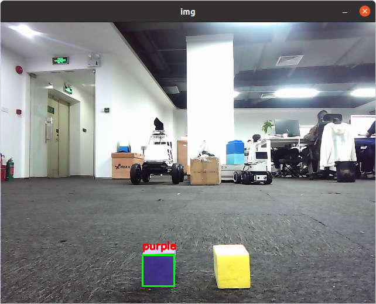

### 8.2 颜色跟踪

#### 8.2.1 功能简介

在ROS中使用OpenCV进行颜色识别的思路是，使用cv_bridge将ROS图像消息转换为OpenCV格式，然后在图像上应用颜色阈值过滤，提取感兴趣的颜色范围。标记检测结果，然后 根据检测到的结果判断是否需要向/cmd_vel话题发布数据。

#### 8.2.2 功能实现

> 注：在运行命令之前，请确保其他终端中的程序已经终止，终止命令为：Ctrl+c

启动摄像头：

```
ros2 launch orbbec_camera dabai.launch.py
```

启动颜色识别功能，在终端中输入命令：

```
ros2 run limo_visions object_detect
```

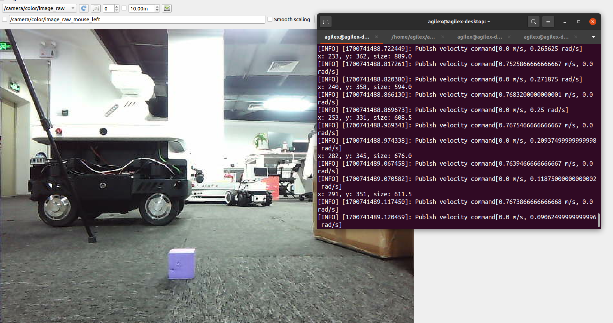

### 8.3 视觉巡线功能

#### 8.3.1 功能介绍

在ROS中通过OpenCV实现视觉巡线功能的思路是：首先，订阅摄像头图像话题获取实时图像。然后，使用cv_bridge库将ROS图像消息转换为OpenCV格式。通过图像处理技术，如颜色阈值或边缘检测，提取巡线的特征。接着，检测巡线的位置与方向，计算机器人需要调整的航向角度。最后，将控制指令发布到机器人底盘控制话题，如/cmd_vel。

#### 8.3.2 功能实现

> 注：在运行命令之前，请确保其他终端中的程序已经终止，终止命令为：Ctrl+c

启动摄像头：

```
ros2 launch orbbec_camera dabai.launch.py
```

启动视觉巡线功能，在终端中输入指令

```
ros2 run limo_visions detect_line
```


### 8.4 红绿灯识别

#### 8.5.1 功能介绍

在ROS中通过OpenCV实现红绿灯功能的思路是：首先，订阅摄像头图像话题以获取实时图像。然后，使用cv_bridge库将ROS图像消息转换为OpenCV格式。通过颜色阈值，提取图像中的红绿灯区域。接着，分析灯的颜色状态，确定红绿灯的当前状态。最后，将识别到的红绿灯状态发布出来。

#### 8.5.2 功能实现

> 注：在运行命令之前，请确保其他终端中的程序已经终止，终止命令为：Ctrl+c

启动摄像头：

```
ros2 launch orbbec_camera dabai.launch.py
```

启动红绿灯识别功能，在终端中输入指令：

```
ros2 run limo_visions traffic_light 
```


## 十、机械臂控制（选配）

> **Mycobot机械臂为选配，标准Limo Pro没有搭配机械臂**

> **特殊说明，由于Limo Pro 是ROS1 Noetic 和 ROS Foxy并存的，所以每次打开一个新终端时需要选择使用ROS1或是ROS2**
>
> **打开终端，输入2，回车确定，选择ROS2 Foxy，在终端中输入命令：**


Mycobot机械臂具有两种控制方式。首先，可以直接调用API接口，通过赋予机械臂六个关节角度来实现控制。这种方式可以让用户直接指定机械臂的运动轨迹和姿态，从而精确控制其动作。其次，Mycobot还支持使用MoveIt进行控制。用户可以设定目标点，由MoveIt计算出六个关节角度，并将这些角度发送给机械臂。这种方式更加灵活，可以通过目标点的设定来实现更加复杂的运动规划和控制，同时也能够适应不同的工作场景和需求。无论是直接调用API接口还是使用MoveIt，Mycobot都能够提供高效、精准的机械臂控制，满足用户在不同场景下的需求。

打开机械臂，若进入如下的界面，需要进行通讯配置。选择Transponder,点击ok.


再选择USB UART，点击ok。

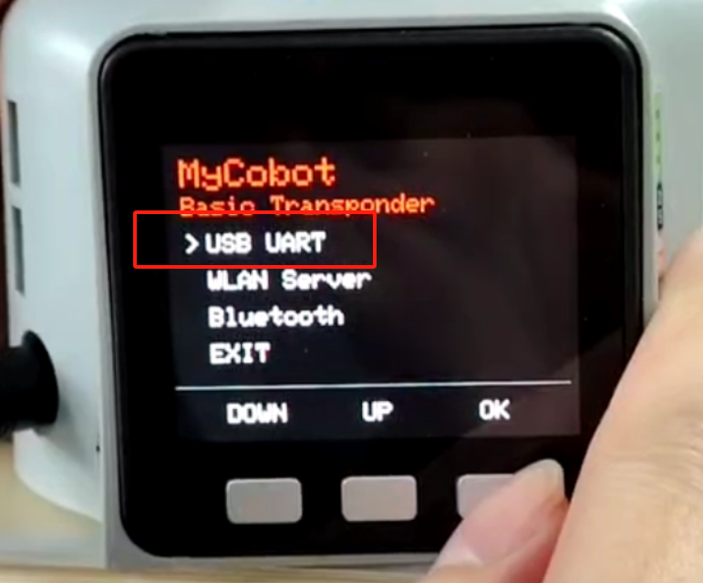

成功后会出现Atom:ok字样。

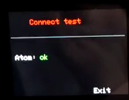

### 10.1 使用滑块控制机械臂（选配）

> 注：启动之前确保已经连接好机械臂

启动滑块控制节点，打开一个新终端，在终端中输入命令：

```bash
ros2 launch mycobot_280 slider_control.launch.py port:=/dev/ttyACM0 baud:=115200
```


可以通过拖动滑块来控制机械臂移动。

### 10.2 模型跟随真实机械臂（选配）

> 注：启动之前确保已经连接好机械臂

启动模型跟随机械臂功能，打开一个新终端，在终端中输入：

```
ros2 launch mycobot_280 mycobot_follow.launch.py 
```


### 10.3 GUI控制机械臂（选配）

> 注：启动之前确保已经连接好机械臂

使用一个简单的GUI界面控制机械臂运动，启动一个新的终端，在终端之后输入命令：

```bash
ros2 launch mycobot_280 simple_gui.launch.py
```

启动成功后，可以在gui界面中输入各个关节的角度信息或者位置信息


## 附录

### 附录1、三视图

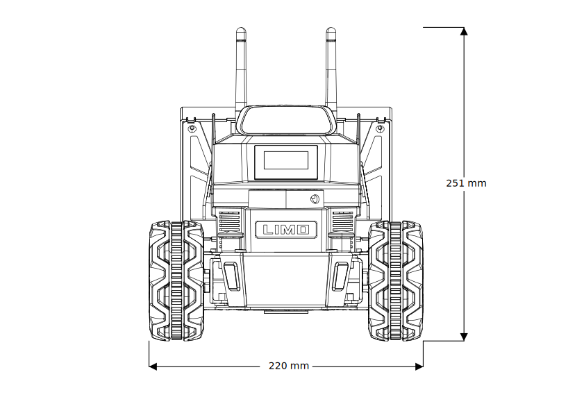


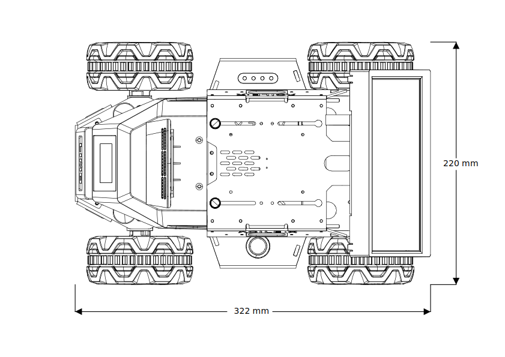

### 附录2、基本操作命令

#### 2.1 目录操作命令

##### (1) 目录切换 cd

① cd /     切换到根目录

② cd /usr     切换到根目录下的usr目录

③ cd ../     切换到上一级目录 或者  cd ..

④ cd ~     切换到home目录

⑤ cd -     切换到上次访问的目录

##### (2) 目录查看 ls

① ls     查看当前目录下的所有目录和文件

② ls -a    查看当前目录下的所有目录和文件（包括隐藏的文件）

③ ls -l或ll  列表查看当前目录下的所有目录和文件（列表查看，显示更多信息）

④ ls /dir   查看指定目录下的所有目录和文件如：ls /usr

##### (3) 创建目录 mkdir

① mkdir aaa 在当前目录下创建一个名为aaa的目录

② mkdir /usr/aa 在指定目录下创建一个名为aaa的目录

##### (4) 显示隐藏目录 Ctrl+h

在文件夹中，通过 Ctrl+h可以显示文件夹中的隐藏文件夹

##### (5) 终止程序 Ctrl+c

在终端中输入命令 Ctrl+c ，强制终止正在执行的程序


 

 

 

 

 

 

 

 
