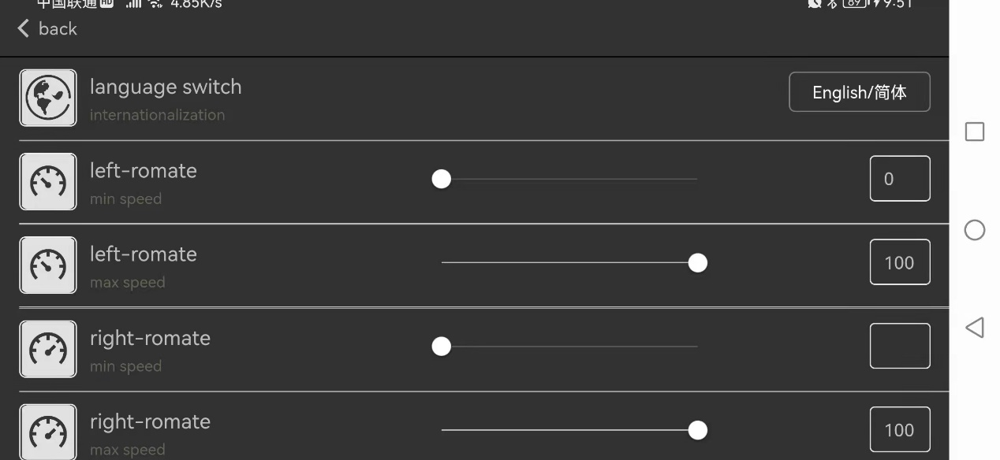
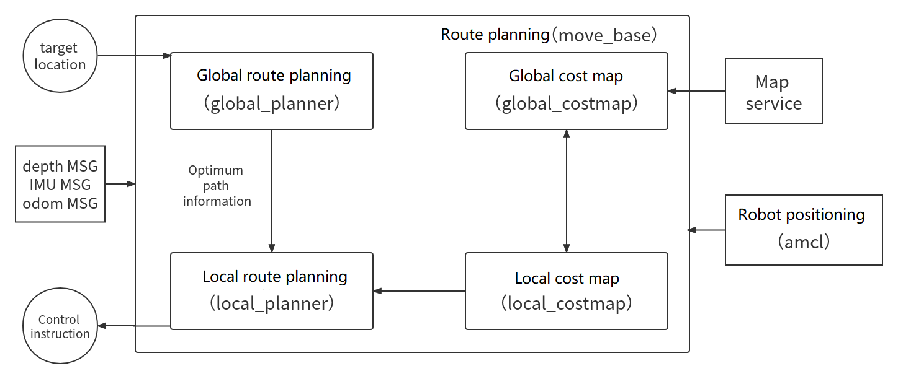
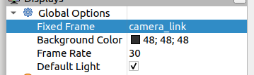
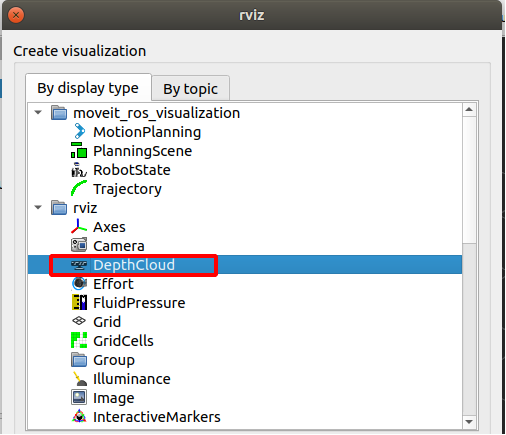
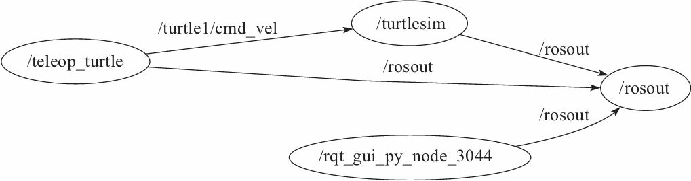
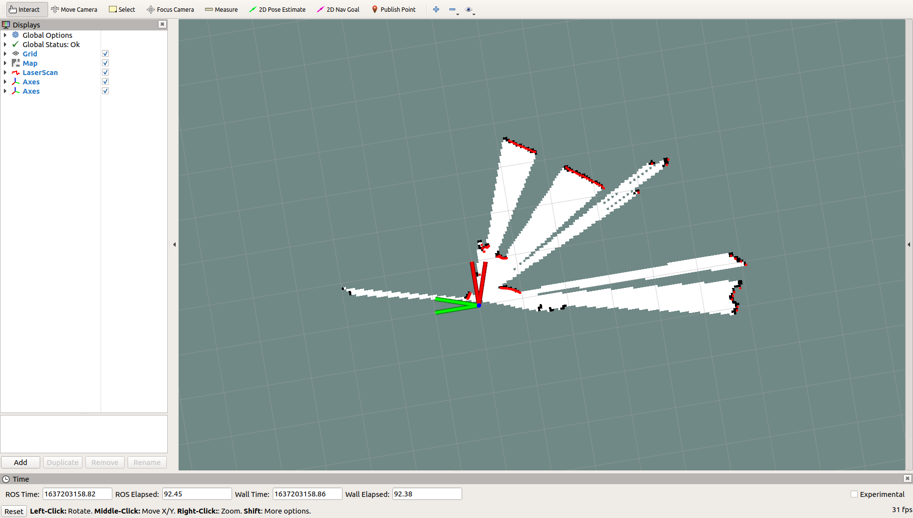
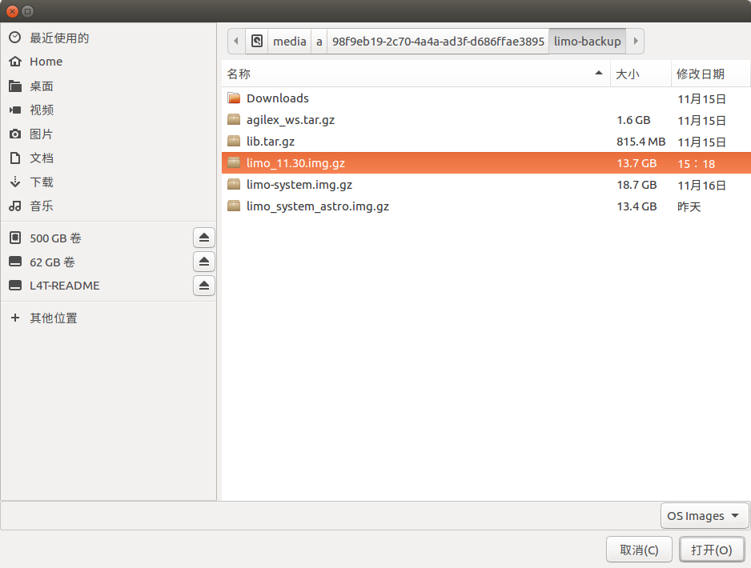
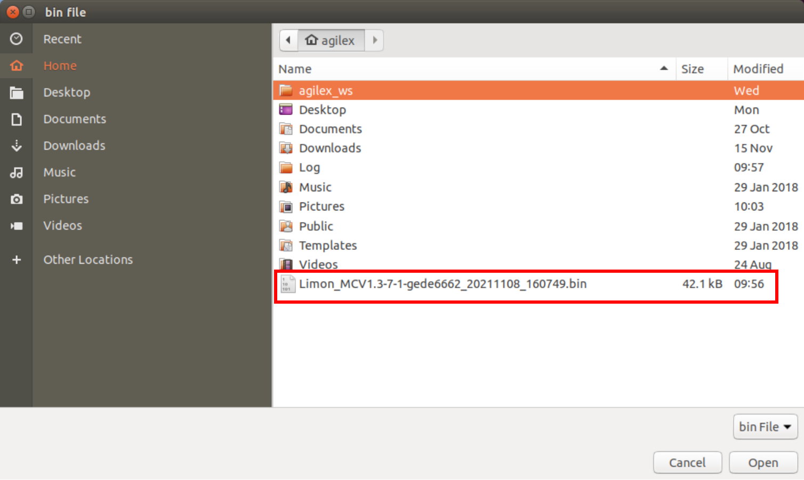

[TOC]

# LIMO PRO Usage and Development Manual

中文 | EN

Version: 1.0.0

| Version | Update information               | Editor          |
| ------- | -------------------------------- | --------------- |
| 1.0.0   | First version opened to customer | Agilex ROS TEAM |
|         |                                  |                 |
|         |                                  |                 |

## 1 LIMO Introduction

### 1.1 Preface

AgileX Robotics LIMO is the world's first ROS development platform that integrates four motion modes. It provides a learning platform that adapts to a wider range of scenarios and is more in line with industry application requirements. It is suitable for robot education, function research and development, and product development. Through innovative mechanical design, it can realize the fast switching of four-wheel differential, Ackermann, track-type, and Mecanum wheel motion modes, and can quickly establish multi-scene practical teaching and testing in the supporting professional sand table. LIMO is equipped with NVIDIA Jeston Nano, EAI Tmini Pro LiDAR, depth camera and other high-performance sensor configurations, which can realize rich functions such as precise autonomous positioning, SLAM mapping, route planning, autonomous obstacle avoidance, autonomous reverse stall parking, traffic light recognition and so on.

At the same time, AgileX Robotics and Gu Yueju, the domestic ROS community teaching pioneer, are committed to combining enterprise employment and industry application needs to create a new ROS boutique course based on the LIMO-developed car to help colleges and universities in scientific research and teaching, so that students can meet higher technical requirements for industry applications.

### 1.2 Component list

（1）Limo Body

| Name               | Quantity                     |
| ------------------ | ---------------------------- |
| LIMO high-end body | x1                           |
| Battery            | x1                           |
| Charger            | x1                           |
| Mecanum wheel      | x4                           |
| APP_Nexus          | X1                           |
| Track              | x2                           |
| Cross screwdriver  | 1                            |
| Screw              | M3x12mm，3pcs；M3x5mm，20pcs |

 


（2）Mycobot robotic arm（**Optional**）

> **The Mycobot robotic arm is optional. The standard Limo Pro does not come with a robotic arm.**


### 1.3 Tech specifications

（1）Limo Body

<table>
	<tr>
		<td>Item</td>
		<td>Parameters</td>
        <td>Values</td>
	</tr>
	<tr>
		<td rowspan="7">Mechanical</td>
		<td>Overall dimension</td>
        <td>322*220*251mm</td>
	</tr>
	<tr>
		<td>Wheel base</td>
        <td>200mm</td>
	</tr>
    	<tr>
		<td>Tread</td>
        <td>175mm</td>
	</tr>
    	<tr>
		<td>Dead load</td>
        <td>4.8kg</td>
	</tr>
    	<tr>
		<td>Load</td>
        <td>4kg</td>
	</tr>
    	<tr>
		<td>Minimum ground clearance</td>
            <td>24mm</td>
	</tr>
    	<tr>
		<td>Drive type</td>
            <td>Hub motor(4x14.4W)</td>
	</tr>
<tr>
		<td rowspan="4">Performance</td>
		<td>No-load max. speed</td>
        <td>1m/s</td>
	</tr>
<tr>
		<td>Ackermann minimum turning radius</td>
        <td>0.4m</td>
	</tr>
<tr>
		<td>Work environment</td>
        <td>-10~+40℃</td>
	</tr>
<tr>
		<td>Max. climbing capacity</td>
        <td>20°</td>
	</tr>
	<td rowspan="11">System</td>
		<td>Power interface</td>
        <td>DC（5.5x2.1mm)</td>
	</tr>
    	<tr>
		<td>IPC</td>
        <td>jetson orin nano</td>
	</tr>
	<tr>
		<td>OS</td>
        <td>Ubuntu20.04</td>
	</tr>
    	<tr>
		<td>IMU</td>
        <td>HI226</td>
	</tr>
    	<tr>
		<td>CPU</td>
        <td>6-core Arm® Cortex®-A78AE</td>
	</tr>
    	<tr>
	</tr>
    	<tr>
		<td>GPU</td>
        <td>1024 CUDA cores</td>
	</tr>
    	<tr>
		<td>Battery</td>
            <td>10Ah 12V</td>
	</tr>
    	<tr>
		<td>Working time</td>
            <td>2.5H</td>
	</tr>
    	<tr>
		<td>Stand-by time</td>
            <td>4h</td>
	</tr>
    	<tr>
		<td>Communication interface</td>
            <td>WIFI,Bluetooth</td>
	</tr>
	<td rowspan="5">Sensor</td>
		<td>LIDAR</td>
        <td>EAI T-mini Pro</td>
	</tr>
	<tr>
		<td>Depth camera</td>
        <td>DaBai</td>
	</tr>
    	<tr>
		<td>USB-HUB </td>
            <td>TYPE-C x1、USB2.0 x2、HDMI</td>
	</tr>
    	<tr>
		<td>Front display</td>
            <td>1.54 inch 128x64 white OLED display screen</td>
	</tr>
    	<tr>
		<td>Rear display</td>
            <td>7 inch 1024x600 IPS touch screen</td>
	</tr>
	<td rowspan="2">Control</td>
		<td>Control mode</td>
        <td>Mobile APP，command control</td>
	</tr>
	<tr>
		<td>Mobile APP</td>
        <td>Bluetooth，maximum distance 10m</td>
	</tr>
</table>

（2）Mycobot robotic arm（**Optional**）

> **The Mycobot robotic arm is optional. The standard Limo Pro does not come with a robotic arm.**

|       Indicators        | Parameters |
| :---------------------: | :--------: |
| Degrees of freedom(DOF) |     6      |
|         Payload         |    250g    |
|     Working radius      |   280mm    |
|      Repeatability      |   ±0.5mm   |
|         Weight          |    800g    |
|       Power Input       |  12V，5A   |
|  Operating temperature  |   -5-45℃   |
|      Communication      |   Type-C   |


### 1.4 Nvidia Jetson Orin Nano introduction

Jetson Orin Nano is an embedded AI computer based on NVIDIA's Orin chip. It is a member of the NVIDIA Jetson series of products designed to provide developers and manufacturers with a high-performance, low-power AI computing platform. Jetson Orin Nano is a small, low-power computer widely used in intelligent surveillance, robotics, autonomous driving, and other fields.  Equipped in the limo pro version, it can be used for the expansion of robot navigation and positioning, image processing, voice recognition etc.

| Name               | Parameters                                                   |
| ------------------ | ------------------------------------------------------------ |
| GPU                | 1024-core NVIDIA Ampere architecture GPU with 32 tensor cores |
| CPU                | 6-core Arm Cortex-A78AE v8.2                                 |
| Memory             | 8GB 128-bit LPDDR5                                           |
| Storage            | Nvme 128G                                                    |
| Video encode       | 1080p30 supported by 1-2 CPU cores                           |
| Video decode       | 1x 4K60 (H.265) 2x 4K30 (H.265) 5x 1080p60 (H.265) 11x 1080p30 (H.265) |
| Camera             | Up to 4 cameras 8 lanes MIPI CSI-2 D-PHY 2.1                 |
| Networking         | Gigabit Ethernet, external expansion of M.2 Key E interface  |
| Display            | DP X 1                                                       |
| USB                | 4x USB 3.2 Gen2                                              |
| Extended interface | 3x UART, 2x SPI, 2x I2S, 4x I2C, 1x CAN, DMIC & DSPK, PWM, GPIOs |

### 1.5 MyCobot280 M5 robotic arm introduction（Optional）

> **The Mycobot robotic arm is optional. The standard Limo Pro does not come with a robotic arm.**

MyCobot can be re-developed according to the needs of users to achieve personalized customization. It is a productivity tool and a tool for expanding the boundaries of imagination. MyCobot has a dead weight of 800g, a payload of 250g, and an effective working radius of 280mm. It is small in size but powerful in function. It can be used with a variety of end effectors to adapt to various scenarios. It supports the secondary development of multi-platform software and meets the requirements of scientific research and education, smart home, commercial applications and exploration, and other various scene needs.


|      Item       |                          Parameters                          |
| :-------------: | :----------------------------------------------------------: |
| Core parameters | 240MHz dual core. 600DMIPS, 520KB SRAM. Wi-Fi, dual mode Bluetooth |
|   Core flash    |                             4MB                              |
|     Core IO     |                 G19、G21、G22、G23、G25、G33                 |
| Core bluetooth  |                           2.4G/5G                            |
|  Core wireless  |                       2.4G 3D Antenna                        |
|   Core model    |                      M5Stack-basic/Atom                      |

### 1.6 Component name


①　WIFI/Bluetooth antenna；

②　Depth camera;

③　Front display;

④　EAI Tmini Pro;

⑤　Hub motor;

⑥　RGB light;

⑦　Four-wheel differential/Ackermann mode switching latch;

⑧　Power display;

⑨　Left speaker;

⑩　Left seagull door；


⑪　Rear display；

⑫　Battery door；

⑬　Switch；

⑭　Right seagull door；

⑮　Right speaker；

 

⑯　USB-HUB；

 

⑰　Voice module;

⑱　IPC NVIDIA Jetson Nano（4G）；

⑲　Battery；

### 1.7 Function highlights

（1）The use of four hub motors saves the space inside the vehicle body and enables rapid switch of four modes:  Ackermann, four-wheel differential, track and Mecanum wheel on the vehicle body;


①Ackermann mode：

A specialized type of geometry that solves the problem of wheels on the inside and outside of a turn needing to trace out circles of different radii during vehicle steering. A vehicle that employs Ackermann steering geometry uses a four-link equal crank mechanism to ensure that, when turning along a curve, the inside wheel's steering angle is about 2 to 4 degrees larger than that of the outside wheel. This allows the centers of the four-wheel paths to roughly meet on the extension line of the rear axle, allowing the vehicle to turn smoothly. Once the wheels have reached the center, they instantaneously turn towards it, enabling the vehicle to complete the turn seamlessly.

 

②Four-wheel differential mode：

Four-wheel drive, which can achieve in-situ auto-rotation, but it will cause serious tire wear; please do not auto-rotate in-situ for a long time；

 

③Track mode：

It has good off-road performance and can climb 40° slopes and small steps；

 

④Mecanum wheel mode：

The omni-directional motion equipment based on Mecanum wheel technology can achieve forward, lateral, oblique, rotation and combinations of motion modes.


（2）Indication of vehicle light status：

The two lights on the vehicle are RGB LEDs, using 5 high-contrast colors as indicator lights. The remaining colors can be customized by developers；

| Color        | Status                             |
| ------------ | ---------------------------------- |
| Red flashing | Low battery/Master control alarm   |
| Red          | Software shut down                 |
| Green        | Ackermann mode                     |
| Yellow       | Four-wheel differential/Track mode |
| Blue         | Mecanum wheel mode                 |

（3）Doors on both sides can be opened. One TYPE-C port and two USB2.0 ports are reserved for easy debugging;

 

（4）Abundant expansion holes are reserved：

Eight M3 screw holes and two 3.2mm wide notches are reserved on the roof;


Four M3 screw holes are reserved for the two doors to expand horizontally to obtain a larger mounting platform;


Four M3 screw holes are reserved at the front and rear of the underbody；

 

（5）Rich interactive experience:

Camera, LiDAR, voice module, dual speakers and front display provide rich interactive experience.


### 1.8 Mode switching method

（1）Switch to Ackermann mode:

First, pull out the latches on both sides. And then turn them 30 degrees clockwise making the longer lines on the two latches point in front of the car.   In this way, they will be stuck. When the vehicle light turns green and stays on, the switch is successful.


（2）Switch to four-wheel differential mode:

Pull up the two latches, and turn 30 degrees clockwise to make the shorter line on the two latches points to the front of the vehicle body. At this point, it is in insertion state. Fine-tune the tire angle to align the hole so that the latch is inserted. When the vehicle light turns yellow and stays on, the switch is successful.

 


（3）Switch to track mode:

In the four-wheel differential mode, put the track on directly. It is recommended to put the track on the rear wheel with a small space first. And in the track mode, please lift the doors on both sides to prevent scratches.

 

（4）Switch to Mecanum wheel mode:

First remove the hubcaps and tires, leaving only the hub motor. Then ensure that the small roller of each Mecanum wheel is facing the center of the body. Install the Mecanum wheel with the M3*5 screw in the package. Finally, adjust to the Mecanum wheel mode with remote control /APP.


 


 

**Note: When switching to Mecanum wheel mode, make sure that each Mecanum wheel is installed at the angle shown above.**

### 1.9 Operation instructions

（1）Long press the switch to start (short press it to pause the program). Observe the electricity meter, and charge or replace the battery in time when the last red light is on.


（2）Observe the status of the front latch and the color of the car lights to determine the current mode:


<table>
<tr>
	<td>Latch status</td>
	<td>Color of light</td>
	<td>Current mode</td>
</tr>
	<tr>
        <td rowspan="2"> Push down</td> 
        <td>Yellow</td>
        <td>4-wheel diff or Track</td>
    </tr>
    <tr>
        <td>Blue</td>
        <td>Macanum wheel</td>
    </tr>
<tr>
	<td>Pull up</td>
	<td>Green</td>
	<td>Ackerman</td>
</tr>
</table>


（3）Remote controller instructions

Remote controller preparation: Slide the power button to the right to turn it on, and switch the SWB channel to the middle for remote control. The lower part is for command control, and the upper part is for close control.

 


 

Differential mode: Switch the SWD channel to the middle or lower gear to enter the four-wheel differential mode. The left joystick controls moving forward or backward, and the right joystick controls left or right rotation.

 

 

Track mode: Same as the differential mode.

 

 

Mecanum mode：When the SWD channel is in the upper gear, it is in Mecanum wheel mode. The left joystick controls the direction of movement, and the right joystick controls left and right rotation.

 

Ackerman mode:  Turn on the remote control. The left joystick controls forward and backward, and the right joystick controls the left and right rotation.

 

（4）Instructions on APP remote control

1. First download the APP--Nexus provided by our company on the mobile phone. The download method is as follows: 

​	IOS download: search for Nexus in AppStore and download it.

​	For Android, scan the following QR code:

​	 

​	Download link: https://www.pgyer.com/CjOI

2. After downloading the App successfully, open the App; as shown in Figure 1-1, connect to the Bluetooth of LIMO_xxxxxx; click the Bluetooth icon on the upper left of the Android phone to enter the Bluetooth scanning interface.

​	 

3. Remote control limo


Left lever: control limo forward and backward.

Right lever: Control limo to turn left and right.

Middle progress bar: speed value display.

Mode switching: There are three modes in total, Ackermann motion mode: ackermann; four-wheel differential motion mode: 4wd; Mecanum motion mode: mailun

Ackermann: You need to manually switch LIMO to Ackermann mode, which is mainly used to calibrate the zero point, and control forward and backward as well as rotation angle; 

4wd: You need to manually switch LIMO to the four-wheel differential mode, which mainly controls forward and backward, rotation direction and rotation in place;

Macnum: You need to manually switch LIMO to the Mecanum wheel mode, which mainly controls forward and backward, rotation direction, and rotation in place.

4. Instructions on APP setting




Language switch：Switch between English and Chinese by clicking the button English/Simplified on the right.

Left-romte min speed：Set the minimum speed of LIMO.

Left-romte max speed：Set the maximum speed of LIMO.

right-romte min speed：Set the minimum rotation speed of LIMO.

right-romte max speed：Set the maximum rotation speed of LIMO.

veer calibration：To set the zero point calibration, first click the + sign, and then click Confirm Verify. When the calibration is successful, a reminder box will pop up: Successful calibration.

BlueTooth：Click to pop up the Bluetooth scanning interface.

Bluetooth management:  Click random to generate any name named after LIMO_xxxx, confirm OK and modify the Bluetooth name of the vehicle synchronously. Note that the Bluetooth will be disconnected at this time and will remind you to reconnect the Bluetooth. After reconnecting the Bluetooth, you can continue to control the vehicle; when the app is started again, the Bluetooth name of the vehicle has been modified successfully.

### 1.10 Remote desktop connection

#### 1.10.1  Download and install NoMachine

First download the corresponding software on your personal computer. Download link: https://www.nomachine.com/download. Download the corresponding version according to your computer's operating system and architecture. 

Connect limo and computer to the same wifi.

#### 1.10.2 Connect to wifi

Open the seagull door on the right side of limo, find the USB-HUB module, and connect the keyboard and mouse to limo. The position of the USB-HUB module is as shown in the figure below:


After the keyboard and mouse are successfully connected, connect Limo to wifi through the following operations, and select the wifi that needs to be connected.


Enter the password of wifi:


#### 1.10.3 Connect limo remotely

Select connection object


Click Yes


Username：agilex

Password：agx

Select to save the password.


Always select the default option : OK.


## 2 Instructions on Chassis Electrical Information

###  2.1 Battery and charging

#### 2.1.1 Basic battery information

LIMO is equipped with a 12V battery with two interfaces. They are the yellow battery output interface and the black battery charging interface.

The parameters of battery are as follow：

| **Items**                 | **Rated parameters** |
| ------------------------- | -------------------- |
| Typical capacity          | 10AH                 |
| Minimum capacity          | 10AH                 |
| Nominal voltage           | 11.1V                |
| Charge cut-off voltage    | 12.6V                |
| Discharge cut-off voltage | 8.25V                |

##### Battery precautions

------

- In order to ensure the safety of transportation and storage, the battery supplied with LIMO is not necessarily fully charged.
- Please do not charge the battery after its power has been depleted. And please charge the battery in time when LIMO’s low battery level alarm is on;

- LIMO will still generate a quiescent standby current when it is turned off. To prevent the battery from over-discharging, please disconnect the battery from the vehicle body when you do not use LIMO for a long time.

- Please do not put the battery in fire or heat up the battery, and please do not store the battery in high-temperature environment. The best temperature for battery storage is -10℃~40℃.

- LIMO must be charged with the original factory-equipped or certified battery.

------

####  2.1.2 Charging

LIMO is equipped with a 12.6V 2A charger by default to meet customers’ charging demand, and there is an indicator light on the charger to show the charging status.

------

- When charging, please turn off the vehicle and remove the battery, and separate the battery output interface from the vehicle body.
- Connect the charging connector of the charger to the battery, and then turn on the charger's power supply for charging.
- When fully charged, please separate the battery from the charger first, and then disconnect the charger.

------

The charger status is as follows:

| **Charger indicator light’s color** | **Charger status**   |
| ----------------------------------- | -------------------- |
| Red                                 | Charging             |
| Green flashing                      | Almost fully charged |
| Green                               | Fully charged        |

##### Charging precautions:

------

- It is forbidden to use non-original chargers to charge the battery, and do not charge the battery below 0°C.
- The battery must be separated from LIMO’s vehicle body when charging, and it is forbidden to supply power to LIMO while charging the battery.
- When the indicator light of the charger turns green, it indicates that the charging is complete. But to prolong the battery life, the charger will trickle charge with a current of 0.1A for about 0.5 hours.

- At present, it takes about 2.5 hours for the battery to reach a fully charged state from 8.25V, and the fully charged voltage of the battery is about 12.6V.

### 2.2 Operational environment and safety precautions

------

- The operating temperature of LIMO is -10°C ~ 40°C. Please do not use it in an environment with a temperature lower than -10°C or higher than 40°C;
- The relative humidity requirements of LIMO's operational environment : maximum 80%, minimum 30%;
- Please do not use it in an environment with corrosive and flammable gas or an environment near flammable substances;
- LIMO is not waterproof, so please do not use it in an environment with rain, snow, or water;
- It is recommended that the altitude of the operational environment should not exceed 1000M, and the temperature difference between day and night should not exceed 25°C;
- In case of any doubts during use, please operate according to the relevant instruction manual or consult related technical personnel;  
- Without technical support and permission, please do not personally modify the internal equipment structure.

### 2.3 Power supply topology


------

- LIMO's battery can provide a maximum current of 10A to power the chassis, Nano, and sensors. When the system detects that the operating current is greater than 10A, it will enter an overcurrent protection mode to protect the battery and motor.

- The total output current of the three USB interfaces of USB HUB is 0.5A at most.

### 2.4 Communication topology


------

- The LIMO chassis has a built-in Bluetooth 5.0 module that can be connected to the APP on the mobile phone to realize the remote control function.
- LIMO and Nano are directly connected through a UART interface, and Nano can control the chassis through this interface.
- USB HUB provides 2 USB interfaces and 1 Type C interface; all 3 interfaces work under the USB 2.0 protocol.
- The back display screen is connected to the USB HUB through the USB 2.0 interface and has a touch function.

## 3 Chassis Driver Drive

The mobile chassis needs to be driven by a program to achieve the navigation of Limo. The chassis driver of Limo has the C++ version and the Python version. Both two versions can control the movement of the Limo.

### 3.1 C++ chassis driver

The folder where the C++ version of the driver is located is ~/agilex_ws/src/limo_ros/limo_base, which can be accessed by the following command.

```
cd agilex_ws/src/limo_ros/limo_base
```

The following is the file list of the limo_base package:

```
├── limo_base
    ├── CMakeLists.txt
    ├── include
    │   ├── limo_driver.h
    │   ├── limo_protocol.h
    │   └── serial_port.h
    ├── launch
    │   └── limo_base.launch
    ├── msg
    │   └── LimoStatus.msg
    ├── package.xml
    └── src
        ├── limo_base_node.cpp
        ├── limo_driver.cpp
        └── serial_port.cpp
```

There are four folders under limo_base, namely include, launch, msg, and src. The include folder stores the library files called by the driver; the launch folder stores the startup files of the driver; the msg folder stores the message files needed by the driver; the src folder stores the driver source code.

| **Folder** | **Stored files**                   |
| ---------- | ---------------------------------- |
| include    | Library files called by the driver |
| launch     | Startup files of the driver        |
| msg        | Message files needed by the driver |
| src        | Driver source code                 |

You can control the forward movement of limo with a simple command.

Note: Before running the command, please make sure that the programs in other terminals have been terminated. The termination command is: Ctrl+c.

1. Launch the chassis, open a terminal, and enter the command in the terminal:

```
ros2 launch limo_base limo_base.launch.py
```

2. Enter the control command, open a terminal, and enter the command in the terminal:

```
ros2 topic pub /cmd_vel geometry_msgs/msg/Twist "linear:
  x: 0.1
  y: 0.0
  z: 0.0
angular:
  x: 0.0
  y: 0.0
  z: 0.0" 
```

**Note:** Copy the entire command to the terminal and enter it, and don’t enter it manually.

After entering the command in the terminal, Limo will move forward for a short distance before stopping.

Functions used in the driver source code:

| **Name**                     | Function                                                     |
| ---------------------------- | ------------------------------------------------------------ |
| connect()                    | Connect the chassis                                          |
| readData()                   | Read the data, and get the information feedback from the chassis |
| processRxData()              | Receive serial data                                          |
| parseFrame()                 | Process serial data                                          |
| sendFrame()                  | Send serial data                                             |
| setMotionCommand()           | Set limo’s control mode                                      |
| enableCommandedMode()        | Enable control mode                                          |
| publishOdometry()            | Publish odometer data                                        |
| publishLimoState()           | Publish limo’s state information                             |
| publishIMUData()             | Publish IMU data                                             |
| processErrorCode()           | Error detection                                              |
| twistCmdCallback()           | Publish speed control data                                   |
| normalizeAngle()             | Output a normal angle                                        |
| degToRad()                   | Turn the angle to radian                                     |
| convertInnerAngleToCentral() | Convert inner angle to central angle                         |
| convertCentralAngleToInner() | Convert central angle to inner angle                         |

### 3.2 Python chassis driver

The driver of Limo (Python version) is uploaded to pypi, and it can be downloaded through the pip command. The installation directory of the program is ~/.local/lib/python3.6/site-packages/pylimo. Its file list is:

```
├── __init__.py
├── limomsg.py	
├── limo.py	
└── __pycache__
    ├── __init__.cpython-36.pyc
    ├── limo.cpython-36.pyc
    └── limomsg.cpython-36.pyc
```

The Python version of the code is relatively concise. There are only three files consisting of the driver. The function of init.py is to declare the files to be used, limomsg.py is the required messages files, and limo.py is the main program and its function is driving Limo.

| **File name** |             Function             |
| :-----------: | :------------------------------: |
|    init.py    |   Declare the files to be used   |
|  limomsg.py   |  Drive to the required messages  |
|    limo.py    | Main program, used to drive limo |

A script is provided to call the driver. The directory of it is agilex_ws/src/limo_ros/limo_base/script, and the name is limomove.py.

This directory can be accessed with the following command. Open a terminal and enter the command in the terminal:

> **Note:** Before running the command, please make sure that the programs in other terminals have been terminated. The termination command is: Ctrl+c.

```
cd agilex_ws/src/limo_ros/limo_base/script
```

Run the script, open the terminal, and enter the command in the terminal:

```
python3 limomove.py
```

After entering the command in the terminal, Limo will move forward for a short distance before stopping.

Functions used in the driver:

| Name                 | Function                 |
| -------------------- | ------------------------ |
| EnableCommand()      | Control enable           |
| SetMotionCommand()   | Set motion command       |
| GetLinearVelocity()  | Get linear velocity      |
| GetAngularVelocity() | Get angular velocity     |
| GetSteeringAngle()   | Get steering angle       |
| GetLateralVelocity() | Get lateral velocity     |
| GetControlMode()     | Get control mode         |
| GetBatteryVoltage()  | Get battery level        |
| GetErrorCode()       | Get error code           |
| GetRightWheelOdem()  | Get left wheel odometer  |
| GetLeftWheelOdem()   | Get right wheel odometer |
| GetIMUAccelData()    | Get IMU acceleration     |
| GetIMUGyroData()     | Get gyroscope data       |
| GetIMUYawData()      | Get IMU course angle     |
| GetIMUPichData()     | Get pitch angle          |
| GetIMURollData()     | Get roll angle           |

## 4 Chassis Kinematics Analysis

> **Note: Becasue ros1 and ros2 are both installed, each time you open a new terminal, please choose 1 (ros1) or 2(ros2)**
>
> **Open a new terminal and input 2. Then click enter.**

Mobile robots are incredibly popular right now, from large autonomous vehicles and the more conventional Automated Guided Vehicles (AGVs) that see extensive industrial use, such as those for intelligent logistics and automated transport, down to the small smart cars on Taobao. These mobile robots come with various chassis types, including two-wheel, three-wheel, and four-wheel designs. For instance, unmanned vehicles typically use a four-wheel Ackermann steering model, while standard AGVs operate with a two-wheel differential drive system. In college robotics competitions, it's common to see three-wheel omnidirectional and four-wheel omnidirectional wheel chassis. Some AGVs even feature a four-wheel skid-steer chassis, adding to the variety that might seem quite bewildering. This section will introduce the four motion modes of Limo from a kinematic perspective.

### 4.1 Four-wheel differential motion mode

A four-wheel differential motion robot can be simplified as a model shown in the figure below. Four wheels are driven by four separate motors.  The robot can be controlled to move forward, backward, and steer only by controlling the velocity of the four wheels.


Assign a reference coordinate system to the robot, where the positive direction of the X-axis is indicated by a red arrow and the positive direction of the Y-axis is denoted by a blue arrow. The Z-axis extends perpendicularly out, originating from the robot's center of mass. This coordinate system adheres to Ampère's right-hand rule for consistency in orientation.

The robot is designed to execute linear movements along the forward and backward directions when the velocities (both magnitude and direction) of all four wheels are identical. However, if there is a variation in the wheel velocities, the robot will engage in a turning motion.

When a robot turns, it pivots around a central point known as the Instantaneous Center of Rotation (ICR), depicted as point ICR in the figure below. Consider the left front wheel as an example; the relative velocity direction at the contact point A where the wheel meets the ground is illustrated in the figure. The vector representing the resultant velocity is perpendicular to the line segment connecting point A and the ICR. The tire is constrained to rotate only in the direction of the longitudinal component of velocity. The decomposition of the velocity vector reveals that there is also a lateral component of velocity present along the axis of the wheel (or the motor axis). 


Due to the varying lateral velocities of the four tires, the robot generates rotational movements, whereas the uniform longitudinal velocities contribute to its forward or backward movements. The combined effect of these components results in the robot executing a circular trajectory around the ICR.

When the robot turns, the angular velocity of the tires on both sides is the same. The inner tire has a smaller turning radius so that the inner linear velocity is smaller. The outer tire has a larger turning radius so that the outer linear velocity is greater. That is, when the velocity on the right side is greater, it will turn left. Similarly, when the velocity on the left side is greater, it will turn right.

Moreover, it can be seen from the figure above that the tires on the same side of the robot have the same Vx (longitudinal component velocity), while the tires at the upper (lower) end have the same Vy (lateral component velocity).  To induce a self-rotation of the vehicle, it is needed to maintain equal velocities in both wheels on one side (either left or right) with a consistent direction while ensuring that the wheels on the opposite side (right or left) also have equal velocities but in the reverse direction. 

We can try to control limo in four-wheel differential mode. First, adjust limo to four-wheel differential mode, pull up the two latches, and turn 30 degrees clockwise to make the shorter line on the two latches points to the front of the vehicle body. At this point, it is in insertion state. Fine-tune the tire angle to align the hole so that the latch is inserted. When the vehicle light turns yellow, the switch is successful.

After the mode switch is successful, run the following command, and we can launch the keyboard or handle to control.

Launch chassis control node

**Note:** Before running the command, please make sure that the programs in other terminals have been terminated. The termination command is: Ctrl+c.

```
ros2 launch limo_base limo_base.launch.py
```

Launch keyboard control node.

```
ros2 run teleop_twist_keyboard teleop_twist_keyboard 
```

### 4.2 Track motion mode

In the track differential mode, a single-sided track can be equivalently regarded as an "infinite number of small wheels", and the "speed" of the single-sided "infinite number of small wheels" is the same. Therefore, the steering mode of the track differential mode is the same as that of the four-wheel differential mode, which is also slide steering.

Specifically, the track differential motion and the four-wheel differential motion are achieved by controlling the relative velocity of the tracks (or wheels) on both sides. But there are also differences between them: the shear and pressure distribution generated by the track on the ground are different from those of the wheels. This difference has little effect when it comes to wheel speed control. When the wheel speeds are inconsistent, we can refer to the following simplified model.


ICR is the center of motion rotation, CENTER refers to the geometric center of the robot, while COM represents the center of mass. During turning, the velocity of the inner track is lower compared to the outer track. To make the vehicle rotate around itself, the left (right) side track should have the same velocity and direction, while the track velocity on the right (left) side should be the same as the other side, but with an opposite direction.

In the four-wheel differential mode, put the track on directly. It is recommended to put the track on the rear wheel with a small space first. And in the track mode, please lift the doors on both sides to prevent scratches.

After the replacement is completed, run the following command, and we can launch the keyboard or handle to control.

Launch chassis control node:

Note: Before running the command, please make sure that the programs in other terminals have been terminated. The termination command is: Ctrl+c.

```
ros2 launch limo_base limo_base.launch.py
```

Launch keyboard control node:

```
ros2 run teleop_twist_keyboard teleop_twist_keyboard 
```

### 4.3 Ackermann motion mode

Ackermann steering structure is the steering method of modern cars, which can solve the problem of different steering angles of the left and right steering wheels caused by the different steering radii of the left and right steering wheels when the car is steering.

Begin with the simplified model of Ackermann motion mode. Similar to differential motion, when all four wheels are given the same velocity (magnitude + direction), the robot is capable of moving forward and backward. However, the differentiating factor lies in turning. To achieve this, the Ackermann steering geometry is employed to calculate the turning radius based on the angle of deflection of the two front wheels.

The geometric center of the robot is denoted by the point CENTER, whereas the midpoint of the rear rod is referred to as the point BASE. In this configuration, the robot executes a circular motion around the ICR, which corresponds to the minimum turning radius. From the diagram, the deflection angles of the two front wheels are not equal, with the difference between these angles (θA-θB) being known as the Ackermann angle. If the robot employs four-wheel drive in the Ackermann motion mode, the inner wheel's velocity will be lower than that of the outer wheel during turning.


Ackermann can be further simplified as the model of the bicycles we usually ride. The orange part in the figure above is the robot’s equivalent bicycle model. Compared with the differential motion mode, the Ackermann motion mode has a turning radius limitation, and the mobile robot cannot achieve spin, that is, the turning radius cannot be zero.

First pull up the latches on both sides, and turn 30 degrees clockwise to make the longer line on the two latches points to the front of the vehicle body, and then they will be stuck. When the light turns green, the switch is successful, and the limo is switched to Ackermann motion mode.

After the mode switch is successful, run the following command, and we can launch the keyboard or handle to control.

After the switch is successful, run the following command, and we can launch the keyboard or handle to control.

Launch chassis control node:

> **Note:** Before running the command, please make sure that the programs in other terminals have been terminated. The termination command is: Ctrl+c.

```
ros2 launch limo_base limo_base.launch.py
```

Launch keyboard control node:

```
ros2 run teleop_twist_keyboard teleop_twist_keyboard 
```

> **Note:** When the vehicle cannot go straight in Ackermann mode, the steering gear calibration is required.

### 4.4 Mecanum motion mode

The Mecanum wheel is a special kind of wheel, which is composed of a hub and rollers: the hub is the main support of the entire wheel, and the rollers are passively moving drums (small wheels) mounted on the hub. The two form a complete big wheel. The angle between the hub axis and the roller shaft on the market can be roughly divided into 30 degrees, 45 degrees, and 60 degrees. In order to meet the geometric relationship of omnidirectional motion, the edge of the hub adopts a bending process to provide mounting holes for the shaft of the roller.


Assuming that the wheel rotates counterclockwise, the force analysis of the Mecanum wheel is carried out. In the coordinate system in the above figure, red represents the x axis, green represents the y axis, blue represents the z axis, the roller coordinate system is represented by a dotted line, and the hub coordinate system is represented by a solid line; the yellow arrow indicates the force analysis of the Mecanum wheel and roller; the blue arrow indicates the speed direction.

The rollers on the periphery of the Mecanum wheel are in contact with the ground. When the Mecanum wheel rotates around the hub axle, the rollers will generate frictional force Ff with the ground, and the force direction is the positive direction of the Y axis of the hub coordinate system. The orthogonal decomposition of Ff along the roller coordinate system shows that F1 is along the negative direction of the Y axis of the roller, and the size is √2/2Ff, and FII is along the positive direction of the X axis of the roller, and the size is √2/2Ff. F1 is the rolling friction of the roller, which causes wear to the roller and cannot change the direction of movement of the tire. FⅡ will force the roller to move in the positive direction of the X axis, so FⅡ is static friction, which promotes the roller to move relative to the ground.


Different wheel arrangements also require different control methods. The omnidirectional movement of the Mecanum wheel is simplified to the model shown in the figure above. The blue arrow indicates the direction of wheel movement, and the orange arrow represents the force analysis of the Mecanum wheel. Combining the forces, we will find that the mobile robot has only one forward force, so the robot will move forward at this time.

Combine the friction of each tire based on the previous four-wheel differential motion mode, the robot can move in any direction. Below are some examples of tire conditions when moving in different directions.


First remove the hub cover and tires, leaving only the hub motor, and then make sure that the small rollers of each Mecanum wheel are facing the center of the vehicle body. Use the M3*5 screws in the package to install the Mecanum wheel. The remote control/APP needs to be adjusted to the Mecanum wheel mode during remote operation.

When the remote control handle is in the four-wheel differential control mode, when channel 8 is in the lowest gear, it switches to the Mecanum wheel control mode, and when it is in the middle and upper gear, it switches back to the differential mode;

Launch chassis control node:

> **Note:** Before running the command, please make sure that the programs in other terminals have been terminated. The termination command is: Ctrl+c.

```
ros2 launch limo_base limo_base.launch.py
```

Launch keyboard control node:

```
ros2 run teleop_twist_keyboard teleop_twist_keyboard 
```

There are many motion modes of mobile robots, and each has its advantages and disadvantages. In real scenes, we can choose the most suitable motion mode according to the characteristics and needs. The following table summarizes the advantages and disadvantages of the four motion modes, for reference only.

| Mode          | **Four-wheel differential**                   | **Track**                                                    | **Ackermann**                                                | **Mecanum**                                                  |
| ------------- | --------------------------------------------- | ------------------------------------------------------------ | ------------------------------------------------------------ | ------------------------------------------------------------ |
| Advantages    | Good motion performance and simple control    | Strong adaptability, good off-road performance, and suitable for a variety of complex sites | Same as the motion mode of a car, which facilitates in-depth research on autonomous driving | Good mobility, and omnidirectional motion                    |
| Disadvantages | Slippage during steering, and large tire wear | Large sliding steering resistance, and large wear on the track | Limited turning radius, and low tire wear                    | High site requirements, non-continuous rollers, vibration during movement, and large wear |


## 5 LiDAR Mapping

### 5.1 Introduction and use of LiDAR

YDLIDAR T-mini Pro lidar is a 360° 2D lidar (hereinafter referred to as T-mini Pro) developed by Shenzhen EAI Technology Co., Ltd. This product is based on the pulse ToF ranging principle, and is equipped with related optical, electrical, and algorithm designs to achieve high-frequency and high-precision distance measurement. At the same time, the mechanical structure rotates 360 degrees to continuously obtain angle information, thereby achieving 360-degree scanning ranging. , output the point cloud data of the scanning environment.

| Items              | Minimum | Default | Maximum | Unit | Remarks                                                      |
| ------------------ | ------- | ------- | ------- | ---- | ------------------------------------------------------------ |
| Ranging frequency  | /       | 4000    | /       | Hz   | 4000 ranging times per second                                |
| Scanning frequency | 6       | 6       | 12      | Hz   | PWM signal needs to be connected, and the recommended frequency is 6Hz. |
| Ranging range      | 0.02    | /       | 12      | m    | Indoor environment, and objects with 80% reflectivity        |
| Scanning angle     | /       | 0-360   | /       | Deg  | /                                                            |
| Ranging accuracy   | /       | 20      | /       | mm   | When 0.05m <ranging≤12m                                      |
| Pitch angle        | 0       | 0.75    | 1.5     | Deg  | /                                                            |
| Angle resolution   | 0.54    |         |         | Deg  |                                                              |

Here's how to use it:

Launch a new terminal and enter the command:

```
ros2 launch limo_bringup limo_start.launch.py
```

After launching successfully, the terminal will output the following log information, as shown in the figure:


Then launch a new terminal and enter the command in the terminal:

```
rviz2
```

After the rviz visualization software runs successfully, the green data displayed is the laser data scanned by LiDAR.


At this time, set the remote control/App to remote control mode and the remote control car will move. The laser data will also change accordingly.

### 5.2 Cartographer mapping

#### 5.2.1 Introduction of cartographer algorithm

Cartographer is a set of SLAM algorithms based on image optimization launched by Google. The main goal of this algorithm is to achieve low computing resource consumption and achieve the purpose of real-time SLAM. The algorithm is mainly divided into two parts. The first part is called Local SLAM. This part establishes and maintains a series of Submaps through each frame of the Laser Scan, and the so-called submap is a series of Grid Maps. The second part called Global SLAM, is to perform closed-loop detection through Loop Closure to eliminate accumulated errors: when a submap is built, no new laser scans will be inserted into the submap. The algorithm will add the submap to the closed-loop detection.

#### 5.2.2 Operation of cartographer mapping

> **Note:** Before running the command, please make sure that the programs in other terminals have been terminated. The termination command is: Ctrl+c.

> **Note:** The speed of limo should be slow  in the process of mapping. If the speed is too fast, the effect of mapping will be affected.

Launch a new terminal and enter the command:

```
ros2 launch limo_bringup limo_start.launch.py
```

Then start the cartographer mapping algorithm. Open another new terminal and enter the command:

```
ros2 launch limo_bringup cartographer.launch.py 
```

After launching successfully, the rviz visualization interface will be shown in the figure below:

After mapping, the map should be saved. 

（1）Enter the map saving directory.

```
cd /home/agilex/limo_ros2_ws/src/limo_ros2/limo_bringup/maps
```

（2）Enter the following command in terminal.

```
ros2 run nav2_map_server map_saver_cli -f map11
```


##  6 LiDAR Navigation

> **Note: Becasue ros1 and ros2 are both installed, each time you open a new terminal, please choose 1 (ros1) or 2(ros2)**
>
> **Open a new terminal and input 2. Then click enter.**

Use the map just built to navigate.

### 6.1 Navigation framework

The key to navigation is robot positioning and path planning. For these, ROS provides the following two packages.

（1）move_base：achieve the optimal path planning in robot navigation.

（2）amcl：achieve robot positioning in a two-dimensional map.

On the basis of the above two packages, ROS provides a complete navigation framework.



The robot only needs to publish the necessary sensor information and navigation goal position, and ROS can complete the navigation function. In this framework, the move_base package provides the main operation and interactive interface of navigation. In order to ensure the accuracy of the navigation path, the robot also needs to accurately locate its own position. This part of the function is implemented by the amcl package.

#### 6.1.1 Move_base package

Move_base is a package for path planning in ROS, which is mainly composed of the following two planners.

(1) Global path planning (global_planner). Global path planning is to plan the overall path according to a given goal position and global map. In navigation, Dijkstra or A* algorithm is used for global path planning, and the optimal route from the robot to the goal position is calculated as the robot's global path.

Local real-time planning (local_planner). In practice, robots often cannot strictly follow the global path. So it is necessary to plan the path that the robot should travel in each cycle according to the map information and obstacles that may appear near the robot at any time. So that it conforms to the global optimal path as much as possible.

#### 6.1.2 Amcl package

Autonomous positioning means that the robot can calculate its position on the map in any state. ROS provides developers with an adaptive (or kld sampling) Monte Carlo localization (amcl), which is a probabilistic positioning system that locates mobile robots in 2D. It implements an adaptive (or KLD-sampling) Monte Carlo localization, using particle filtering to track the pose of the robot on a known map.

#### 6.1.3 Introduction of DWA_planner and TEB_planner

DWA_planner

The full name of DWA is Dynamic Window Approaches. The algorithm can search for multiple paths to avoid and travel, select the optimal path based on various evaluation criteria (whether it will hit an obstacle, the time required, etc.), and calculate the linear velocity and angular velocity during the driving cycle to avoid collisions with dynamic obstacles.

TEB_planner

The full name of "TEB" is Time Elastic Band Local Planner. This method performs subsequent modifications to the initial trajectory generated by the global path planner to optimize the robot's motion trajectory. It falls under the category of local path planning. During the trajectory optimization process, the algorithm takes into account various optimization goals, which include but are not limited to minimizing overall path length, optimizing trajectory execution time, ensuring a safe distance from obstacles, passing through intermediate path points, and complying with the robot's dynamics, kinematics, and geometric constraints. The "TEB method" explicitly considers the dynamic constraints of time and space during the robot's motion. For instance, it considers limitations on the robot's velocity and acceleration.

### 6.2 Limo navigation

> **Note:** In the four-wheel differential mode, the omnidirectional wheel mode and the track mode, the  file run for the navigation is the same.

> **Note:** Before running the command, please make sure that the programs in other terminals have been terminated. The termination command is: Ctrl+c.

（1）First launch the LiDAR. Enter the command in the terminal:

```
ros2 launch limo_bringup limo_start.launch.py
```

（2）Edit the launch file. Enter the following command in terminal. This is to change the 'map11' to the name of map you just saved.

```
gedit /home/agilex/limo_ros2_ws/src/limo_ros2/limo_bringup/launch/limo_nav2.launch.py
```


After editing it, enter to /home/agilex/limo_ros2_ws directory and compile the code.

```
cd /home/agilex/limo_ros2_ws
```

```
colcon build 
```

3）Start the navigation. Input the command in a terminal.

```
ros2 launch limo_bringup limo_nav2.launch.py 
```

> Note: If it is Ackmann motion mode, please run:

```
ros2 launch limo_bringup limo_nav2_ackmann.launch.py 
```

After launching successfully, the rviz will be opened.


（4）After launching the navigation, it may be observed that the laser-scanned shape does not align with the map, requiring manual correction. To rectify this, adjust the actual position of the chassis in the scene displayed on the rviz map. Use the rviz tools to designate an approximate position for the vehicle, providing it with a preliminary estimation. Subsequently, use the handle tool to remotely rotate the vehicle until automatic alignment is achieved. Once the laser shape overlaps with the scene shape on the map, the correction process is concluded. The operational steps are outlined as follows:


The correction is completed:


（4）Set the navigation goal point through '2D Nav Goal'.

 purple path will be generated on the map. Switch the handle to command mode, and Limo will automatically navigate to the goal point.

（5）Multi-waypoints navigation

Click the button to enter the multiple waypoints navigation mode.

!(./LIMO_image/navi_5.png)

Click Nav2 Goal. Set the waypoints. Then click the circled button to navigate.


##  7 Depth Camera + LiDAR Mapping

> **Note: Becasue ros1 and ros2 are both installed, each time you open a new terminal, please choose 1 (ros1) or 2(ros2)**
>
> **Open a new terminal and input 2. Then click enter.**


### 7.1 Introduction and use of ORBBEC®Dabai

ORBBEC®Dabai is a depth camera based on binocular structured light 3D imaging technology. It mainly includes a left infrared camera (IR camera1), a right infrared camera (IR camera2), an IR projector, and a depth processor. The IR projector is used to project the structured light pattern (speckle pattern) to the goal scene, the left infrared camera and the right infrared camera respectively collect the left infrared structured light image and the right infrared structured light image of the goal, and the depth processor executes the depth calculation algorithm and outputs the depth image of the goal scene after receiving the left infrared structured light image and the right infrared structured light image.

| **Parameter name**                                           | **Parameter index**                                          |
| ------------------------------------------------------------ | ------------------------------------------------------------ |
| The distance between the imaging centers of the left and right infrared cameras | 40mm                                                         |
| Depth distance                                               | 0.3-3m                                                       |
| Power consumption                                            | The average power consumption of the whole machine is <2W,<br/>The peak value at the moment the laser is turned on <5W(duration: 3ms),<br/>Typical standby power consumption <0.7W |
| Depth map resolution                                         | 640*400@30FPS<br/>320*200@30FPS                              |
| Color map resolution                                         | 1920X1080@30FPS<br/>1280X720@30FPS<br/>640X480@30FPS         |
| Accuracy                                                     | 6mm@1m(81% FOV area participates in accuracy calculation*)   |
| Depth FOV                                                    | H 67.9° V 45.3°                                              |
| Color FOV                                                    | H 71° V43.7° @1920X1080                                      |
| Delay                                                        | 30-45ms                                                      |
| Data transmission                                            | USB2.0 or above                                              |
| Supported operating system                                   | Android / Linux / Windows7/10                                |
| Power supply mode                                            | USB                                                          |
| Operating temperature                                        | 10°C ~ 40°C                                                  |
| Applicable scene                                             | Indoor / outdoor (specifically subject to application scenes and related algorithm requirements) |
| Dustproof and waterproof                                     | Foundation dustproof                                         |
| Safety                                                       | Class1 laser                                                 |
| Dimensions (mm)                                              | Length 59.6 X width 17.4 X thickness 11.1mm                  |

After knowing the basic parameters of ORBBEC®Dabai, start to practice：

> **Note:** Before running the command, please make sure that the programs in other terminals have been terminated. The termination command is: Ctrl+c

First ,start the ORBBEC®Dabai camera and run the following command:

```
ros2 launch astra_camera dabai.launch.py
```

if this doesn't work, try:

```
ros2 launch orbbec_camera dabai.launch.py
```

The following warnings will appear during running. This is because some parameters in the driver are not supported by the camera and can be ignored.


### 7.2 View depth camera information

After successfully opening the depth camera, launch rviz to view the images captured by the depth camera and the depth information collected.

Open a new terminal and enter the command:

```
rviz2
```

Then add the Image component to see the picture captured by the camera. The steps are as follows.


Select camera_link in fixed frame.



Fill in the corresponding topic in the image component to get the rgb picture.


Reliability Choose：Best Effort.


After completing the above operations, you can see the picture captured by the camera in the Image window.


Click add and add the DepthCloud component to view point cloud data



Select camera_link in fixed frame and select the corresponding topic in DepthCloud component.


Show depth map:


### 7.3 Introduction of rtabmap algorithm

RTAB-Map (Real-Time Appearance-Based Mapping) is an algorithm for simultaneous localization and mapping (SLAM) that aims to strike a balance between real-time performance and map quality. RTAB-Map is a graph-based SLAM system that is able to build dense 3D maps at runtime (real-time).

Here are some key features and components of RTAB-Map:

1. **Real-time performance:** RTAB-Map is designed to run in real-time applications, such as robotic navigation or augmented reality systems. Its algorithm is designed to minimize the computational burden to achieve fast and accurate map building and localization with limited computing resources.
2. **Feature-based SLAM:** RTAB-Map uses visual and inertial sensor data to perform feature matching by extracting key points and descriptors for localization and mapping between consecutive frames. This enables it to perform SLAM in the absence of an accurate motion model.
3. **Environmental perception:** RTAB-Map enhances the quality of the map through environmental perception (such as depth information, parallax, etc.). This is very useful for dealing with environments with less texture or repeated structures.
4. **Loop Detection and Closed-Loop Optimization:** RTAB-Map uses loop detection to identify previously visited map areas, and then uses optimization techniques to correct previous trajectories and maps. This helps reduce errors and improve map consistency.
5. **RGB-D Sensor Support:** RTAB-Map directly supports RGB-D sensors such as Microsoft Kinect to obtain depth information, thereby improving the accuracy and density of the map.

### 7.4 Rtabmap algorithm mapping

> Note: Before running the command, please make sure that the programs in other terminals have been terminated. The termination command is: Ctrl+c.
>

> Note: The speed of limo should be low in the process of mapping. If it is too fast, the effect of mapping will be affected.
>

（1）First launch the LiDAR and enter the command in the terminal:

```
ros2 launch limo_bringup limo_start.launch.py
```

（2）Launch the camera and enter the command in the terminal:

```
ros2 launch astra_camera dabai.launch.py
```

if this doesn't work, try:

```
ros2 launch orbbec_camera dabai.launch.py
```

（3）Launch the mapping mode of the rtabmap algorithm, and enter the command in the terminal:

```
ros2 launch limo_bringup limo_rtab_slam.launch.py
```

After building the map, you can terminate the program directly. The built map will be automatically saved in the .ros file in the main directory with the file name rtabmap.db. The .ros folder is a hidden folder and needs to be displayed using the Ctrl+h command.


### 7.5 Rtabmap algorithm navigation

> **Note:** Before running the command, please make sure that the programs in other terminals have been terminated. The termination command is: Ctrl+c.

（1）First launch the LiDAR and enter the command in the terminal:

```
ros2 launch limo_bringup limo_start.launch.py
```

（2）Launch the camera and enter the command in the terminal:

```
ros2 launch astra_camera dabai.launch.py
```

if this doesn't work, try:

```
ros2 launch orbbec_camera dabai.launch.py
```

（3）Launch the positioning mode of the rtabmap algorithm, and enter the command in the terminal:

```
ros2 launch limo_bringup limo_rtab_slam.launch.py localization:=true
```

（4）Launch move_base and enter the command in the terminal:

```
ros2 launch limo_bringup limo_rtab_nav2_diff.launch.py 
```


（5）Because visual positioning is used, there is no need for calibration when using rtabmap navigation. Users can directly start setting the target points and proceed with navigation. The operational steps are shown in the figure.


A green path will be generated in the map. Switch the handle to command mode, and Limo will automatically navigate to the goal point.

## 8 Vision Module

> **Note: Becasue ros1 and ros2 are both installed, each time you open a new terminal, please choose 1 (ros1) or 2(ros2)**
>
> **Open a new terminal and input 2. Then click enter.**


### 8.1 Color recognition

#### 8.1.1 Function introduction

The idea of using OpenCV for color recognition in ROS is to use cv_bridge to convert the ROS image message into OpenCV format, and then apply color threshold filtering on the image to extract the color range of interest. Label detection results, e.g. by drawing bounding boxes, and publish the results to a new ROS topic for use by other nodes. The process includes image acquisition, color space conversion, threshold processing, and result release, allowing the robot to identify target color areas in real-time.

#### 8.1.2 Running function

> Note: Before running the command, please make sure that the programs in other terminals have been terminated. The termination command is: Ctrl+c.
>

Start the camera.

```
ros2 launch astra_camera dabai.launch.py
```

if this doesn't work, try:

```
ros2 launch orbbec_camera dabai.launch.py
```

Enter the command to launch the color recognition.

```
ros2 run limo_visions recognition
```


### 8.2 Color following

#### 8.2.1 Function introduction

The idea of using OpenCV for color recognition in ROS is to use cv_bridge to convert the ROS image message into OpenCV format, and then apply color threshold filtering on the image to extract the color range of interest. Mark the detection results, and then determine whether it is necessary to publish data to the /cmd_vel topic based on the detection results.

#### 8.2.2 Running Function

> Note: Before running the command, please make sure that the programs in other terminals have been terminated. The termination command is: Ctrl+c.

Start the camera.

```
ros2 launch astra_camera dabai.launch.py
```

if this doesn't work, try:

```
ros2 launch orbbec_camera dabai.launch.py
```

Start the color recognition function.

```
ros2 run limo_visions object_detect
```


### 8.3 Visual line following

#### 8.3.1 Function introduction

The idea of implementing the visual line following function through OpenCV in ROS is: first, subscribe to the camera image topic to obtain real-time images. Then, use the cv_bridge library to convert the ROS image message to OpenCV format. Line-following features are extracted through image processing techniques such as color thresholding or edge detection. Then, detect the position and direction of the line patrol, and calculate the heading angle that the robot needs to adjust. Finally, publish the control instructions to the robot chassis control topic, such as /cmd_vel.

#### 8.3.2 Running function

> Note: Before running the command, please make sure that the programs in other terminals have been terminated. The termination command is: Ctrl+c.

Start the camera：

```
ros2 launch astra_camera dabai.launch.py
```

if this doesn't work, try:

```
ros2 launch orbbec_camera dabai.launch.py
```

Run detecting line function.

```
ros2 run limo_visions detect_line
```

### 8.4 Identifying traffic lights

#### 8.4.1 Function introduction

The idea of implementing the traffic light recognition function through OpenCV in ROS is: first, subscribe to the camera image topic to obtain real-time images. Then, use the cv_bridge library to convert the ROS image message to OpenCV format. Extract the traffic light areas in the image through color thresholding or machine learning models. Next, the color status of the light is analyzed to determine the current status of the traffic light. Finally, the recognized traffic light status is published.

#### 8.4.2 Running function

> Note: Before running the command, please make sure that the programs in other terminals have been terminated. The termination command is: Ctrl+c.

Start the camera:

```
ros2 launch astra_camera dabai.launch.py
```

if this doesn't work, try:

```
ros2 launch orbbec_camera dabai.launch.py
```

Start traffic lights recognition.

```
ros2 run limo_visions traffic_light 
```


## 10 Robotic arm control (optional)

> **Note: Becasue ros1 and ros2 are both installed, each time you open a new terminal, please choose 1 (ros1) or 2(ros2)**
>
> **Open a new terminal and input 2. Then click enter.**


> The Mycobot robotic arm is optional, the standard Limo Pro does not come with a robotic arm

The Mycobot robotic arm has two control modes. Firstly, it can be controlled by directly calling the API interface and assigning six joint angles to the robotic arm. This allows users to specify the motion trajectory and posture of the robotic arm, enabling precise control of its movements. Secondly, Mycobot also supports control using MoveIt. Users can set a target point, and MoveIt will calculate the six joint angles and send them to the robotic arm. This mode is more flexible and can achieve more complex motion planning and control through the setting of target points, making it adaptable to different work scenarios and requirements. Whether it is by directly calling the API interface or using MoveIt, Mycobot can provide efficient and accurate robotic arm control to meet user needs in different scenarios.

Start the robotic arm. If you see the interface below, please configure the robotic arm communication. Choose'Transponder', click 'ok'.


Then choose 'USB UART' and click ok.


Finally, 'Atom: ok' shows successful configuration.


### 10.1 Use the slider to control the simulated robotic arm (optional)

> Note: Make sure the robotic arm is connected before starting

<span style="background-color: yellow;">**Note:** If any errors occur during use, you can refer to this [link](https://github.com/smalleha/mycobot_ros2_agx.git) to update the code.</span>

Start the slider control node. Open a new terminal, and enter the command in the terminal:

```bash
ros2 launch mycobot_280 slider_control.launch.py port:=/dev/ttyACM0 baud:=115200
```


Control the movement of the robotic arm by dragging the slider.

### 10.2 The model following the real robotic arm (optional)

> Note: Make sure the robotic arm is connected before starting

Start the model following node:

```
ros2 launch mycobot_280 mycobot_follow.launch.py 
```

After successful startup, the robotic arm will be unlocked. At this time, the robotic arm can be moved by hand, and the model in rviz will also move accordingly.


### 10.3 GUI control of robotic arm (optional)

> Note: Make sure the robotic arm is connected before starting.

Use a simple GUI interface to control the movement of the robotic arm. Start a new terminal and enter the command after the terminal:

```bash
ros2 launch mycobot_280 simple_gui.launch.py
```

After successful launching, the angle information or position information of each joint can be entered in the GUI interface.


## Appendix

### Appendix 1. Three Views


### Appendix 2. Basic Operating Commands

#### 2.1 Directory operating commands

##### (1) Directory switch: cd

① cd /     switch to the root directory

② cd /usr     switch to the usr directory under the root directory

③ cd ../     switch to the upper level directory or cd  ..

④ cd ~     switch to the home directory

⑤ cd -     switch to the last visited directory

##### (2) Directory view: ls

① ls: view all directories and files in the current directory

② ls -a: view all directories and files in the current directory (including hidden files)

③ ls -l or ll: list view all directories and files in the current directory (list view, which displays more information)

④ ls /dir: view all directories and files in the specified directory, like: ls /usr

##### (3) Create directory: mkdir

① mkdir aaa: create a directory named aaa in the current directory

② mkdir /usr/aa: create a directory named aaa in the specified directory

##### (4) Show hidden directory: Ctrl+h

In the folder, you can display the hidden folders in the folder by Ctrl+h

##### (5)Terminate program: Ctrl+c

Enter the command Ctrl+c in the terminal to forcefully terminate the program being executed

#### 2.2 ROS commonly used commands

**(1) Compile command: catkin_make**

Used to compile packages in the entire workspace

**(2) Initialize workspace: catkin_init_workspace**

Used to initialize the workspace when creating the workspace for the first time

**(3) Create package: catkin_create_pkg**

Used to create a package, and its syntax is:

```
 catkin_create_pkg <package_name> [depend1] [depend2] [depend3]...
```

##### (4) Node running command

​    ① rosrun is used to run the .cpp files and the .py files, and its syntax is:

```
	rosrun package_name node_name
```

​	② roslaunch is used to run .launch files. In the launch files, the .cpp files and the .py files can be called at the same time, and its syntax is:

```
	roslaunch package_name node_name
```


### Appendix 3. ROS Framework

#### 3.1 ROS architecture design

The ROS architecture is as shown in the figure below, which can be divided into three layers: OS layer, middle layer and application layer.


（1） OS layer

ROS is not an operating system in the traditional sense. It cannot run directly on computer hardware like Windows and Linux. Instead, it needs to rely on the Linux system. So at the OS layer, we can directly use the Ubuntu operating system with the best official support of ROS, or use macOS, Arch, Debian and other operating systems.

(2) Middle layer

Linux is a general system and does not provide special middleware for robot development, so ROS has done a lot of work in the middle layer, the most important of which is the communication system based on TCPROS/UDPROS. The ROS communication system is based on the TCP/UDP network, on which it is re-encapsulated, that is, TCPROS/UDPROS. The communication system uses publish/subscribe, client/server and other models to realize data transmission through multiple communication mechanisms.

In addition to the communication mechanism of TCPROS/UDPROS, ROS also provides an in-process communication method——Nodelet, which can provide a more optimized data transmission method for multi-process communication, which is suitable for applications that have higher requirements for real-time data transmission.

On top of the communication mechanism, ROS provides a large number of libraries related to robot development, such as data type definition, coordinate transformation, motion control, etc., which can be provided to the application layer.

(3) Application layer

At the application layer, ROS needs to run a manager——Master, responsible for managing the normal operation of the entire system. A large number of robot application packages are shared in the ROS community. The modules in these packages run as nodes and use ROS standard input and output as interfaces. Developers do not need to pay attention to the internal implementation mechanism of the modules, but only need to understand the interface rules to achieve reuse, which greatly improves development efficiency.

From the perspective of system implementation, ROS can also be divided into three layers as shown in the following figure: file system, computation graph, and open source community.


#### 3.2 Computation graph

From the perspective of the computation graph, the functional modules of the ROS system software run independently in units of nodes, which can be distributed in multiple same or different hosts, and are connected through an end-to-end topology when the system is running.

##### 3.2.1 Node

Nodes are processes that perform computing tasks. A system generally consists of multiple nodes, which can also be called "software modules." The introduction of the node concept makes the ROS-based system more vivid at runtime: When many nodes are running at the same time, it is easy to draw the end-to-end communication into the node diagram as shown below, in which the process is the node, and the end-to-end connection is the connecting line between the nodes.



##### 3.2.2 Message

The most important communication mechanism between nodes is the message communication based on the publish/subscribe model. Each message is a strict data structure, which supports standard data types (integer, floating point, Boolean, etc.), as well as nested structures and arrays (similar to the structure of C language), and can also be independently defined by the developer according to requirements.

##### 3.2.3 Topic

Messages are delivered in a Publish/Subscribe manner (see the figure below). A node can publish a message for a given Topic (called Talker), or it can follow a topic and subscribe to a specific type of data (called Listener). Talkers and Listeners do not know each other's existence. There may be multiple nodes in the system simultaneously publishing or subscribing to the same topic.


##### 3.2.4 Service

Although the topic-based publish/subscribe model is a very flexible communication mode, it is not suitable for the two-way synchronous transmission mode. In ROS, we call this synchronous transmission mode Service, which is based on the Client/Server model and contains two parts of communication data types: one for request and the other for response, similar to a Web server. Different from the topic, only one node is allowed to provide the specified naming service in ROS.

**3.2.5 Master**

In order to manage the above concepts as a whole, there needs to be a controller in the system to make all nodes execute in an orderly manner. This is the ROS Master. ROS Master provides registration lists and search functions for other computation graphs through remote procedure call (RPC), helps ROS nodes to find and establish connections with each other, and also provides a parameter server for the system to manage global parameters. ROS Master is a manager. Without it, nodes will not be able to find each other, exchange messages, or call services, and the entire system will crash. This shows its importance in the ROS system.

#### 3.3 File system

Similar to the operating system, ROS organizes all files according to certain rules, and files with different functions are placed in different folders, as shown in Figure 2-5.

Package: The package is the basic unit of ROS software, including ROS nodes, libraries, configuration files, etc.

Package Manifest: Each package contains a package manifest named package.xml, which is used to record the basic information of the package, including author information, license information, dependent options, compilation flags, etc.

Meta Package: In the new version of ROS, the concept of the original Stack is upgraded to "Meta Package", whose main function is to organize multiple packages for the same purpose. For example, a ROS navigation meta package will contain multiple packages such as modeling, positioning, and navigation.

Meta Package Manifest: Not shown in the figure below. It is similar to the package manifest. The difference is that the meta package manifest may contain packages that need to be relied upon at runtime or tags for declaring some references.


Message type: Message is the communication information published/subscribed between ROS nodes. You can use the message type provided by ROS, or you can use the .msg file to customize the required message type in the msg folder of the package.

Service type: The service type defines the request and response data type under the ROS client/server communication model. You can use the service types provided by the ROS system; you can also use the .srv file to define in the srv folder of the package.

Code: The folder used to place the source code of the package node.

#### 3.4 Open source community

The resources in the ROS open source community are very rich, and the following software and knowledge can be shared through the network (see Figure 2-9).

Distribution: Similar to the Linux distribution, the ROS distribution includes a series of packages with version numbers that can be installed directly. This makes ROS’s software management and installation easier, and it can maintain a unified version number through software collections.

Repository: ROS relies on the open source code on the shared network, and different organizations can develop or share their own robotic software.

ROS wiki: The main forum for documenting ROS information. Everyone can register, log in to the forum, upload their own development documents, update, and write tutorials.

Mailing List: The ROS mailing list is the main channel for communicating ROS updates, as well as various questions about ROS development.

ROS Answers: ROS Answers is a website for inquiring about ROS related questions. Users can submit their own questions on this website and get answers from other developers.

Blog: Publish news, pictures, and videos in the ROS community (http：//[www.ros.org/news](http://www.ros.org/news)).

#### 3.5 Communication mechanism

ROS is a distributed framework that provides users with communication services between multiple nodes (processes). All software functions and tools are based on this distributed communication mechanism, so the ROS communication mechanism is the lowest and most core technology. In most application scenes, although we don't need to pay attention to the implementation mechanism of the underlying communication, understanding its related principles will definitely help us make better use of ROS in the development process. The three core communication mechanisms of ROS are introduced below.

3.5.1 Topic communication mechanism

Topic is used most frequently in ROS, and its communication model is also more complicated. As shown in the figure below, there are two nodes in ROS: one is Talker, and the other is Listener. Two nodes publish and subscribe to the same topic separately. There is no mandatory requirement for the startup sequence. Here, assuming that Talker starts first, it can be divided into the seven steps shown in the figure to analyze the detailed process of establishing communication.


1.Talker registration

Talker starts and uses RPC to register Talker's information with ROS Master through port 1234, including the topic name of the published message; ROS Master will add the registration information of the node to the registration list.

2. Listener registration

The Listener starts and also registers Listener’s  information with ROS Master through RPC, including the topic name that needs to be subscribed.

3. ROS Master performs information matching

The Master searches the registration list based on the subscription information of the Listener. If no matching Talker is found, it waits for the Talker to join; if it finds the matching Talker information, it sends the Talker's RPC address information to the Listener via RPC.

4. Listener sends a connection request

The Listener receives the Talker address information sent back by the Master, and tries to send a connection request to the Talker via RPC, and transmits the topic name, message type and communication protocol (TCP/UDP) subscribed to.

5. Talker confirms the connection request

After the Talker receives the connection request sent by the Listener, it continues to confirm the connection information to the Listener via RPC, which contains its own TCP address information.

6. Listener tries to establish a network connection with Talker

After the Listener receives the confirmation message, it uses TCP to try to establish a network connection with the Talker.

7. Talker publishes data to Listener

After successfully establishing a connection, Talker starts to send topic message data to Listener.

From the above analysis, it can be found that the communication protocol used in the first five steps is RPC, and TCP is used only in the process of publishing data.

ROS Master plays an important role in the process of establishing connections between nodes, but does not participate in the final data transmission between nodes.

After the nodes have established a connection, you can turn off the ROS Master, and the data transmission between the nodes will not be affected, but other nodes cannot join the network between the two nodes.

**3.5.2 Parameter management mechanism**

The parameters are similar to global variables in ROS and are managed by ROS Master. Their communication mechanism is relatively simple and does not involve TCP/UDP communication, as shown in the figure below.


1.Talker sets variables

The Talker uses RPC to send parameter setting data to ROS Master, including parameter names and parameter values; ROS Master saves the parameter names and parameter values in the parameter list.

2. Listener searches parameter values

The Listener sends a parameter search request to the ROS Master via RPC, including the parameter name to be searched.

3. ROS Master sends parameter values to Listener

The Master searches the parameter list according to the Listener's search request. After finding the parameters, it uses RPC to send the parameter values to the Listener.

It should be noted here that if the Talker updates the parameter values to the Master, the Listener cannot know that the parameter values have been updated without searching the parameter values again. Therefore, in many application scenes, a dynamic parameter update mechanism is required. Chapter 12 will specifically explain the implementation of the dynamic parameter configuration function in ROS.


### Appendix 4. ROS Basics

#### 4.1 Workspace

The main method of using ROS to realize robot development is of course to write code, so these code files need to be placed in a fixed space, that is, the workspace.

4.1.2 What is a workspace

Workspace is a folder for storing project development related files. ROS after the Fuerte version uses the Catkin compilation system by default. The workspace structure under a typical Catkin compilation system is as follows.

A typical workspace generally includes the following four directory spaces.

(1) src: code space, the most commonly used folder in the development process, used to store the source code files of all ROS packages.

(2) build: compilation space, used to store the cache information and intermediate files generated during the compilation of the workspace.

(3) devel: development space, used to place executable files generated by compilation.

(4) lib: installation library space. After the compilation is successful, you can use the make install command to install the executable files into the space, and run the environment variable scripts in the space to run these executable files in the terminal. The installation library space is not necessary, and this folder may not be available in many workspaces.

4.2.2 Create a workspace

The command to create a workspace is relatively simple. First, use the system command to create the workspace directory, and then run the ROS workspace initialization command to complete the creation process:

Create a folder named catkin_ws and continue to create a folder named src under catkin_ws.

```
 mkdir -p ~/catkin_ws/src
```

Switch to the src folder under the catkin_ws folder.

```
 cd ~/catkin_ws/src
```

Initialize the folder.

```
 catkin_init_workspace
```

After the creation is complete, the catkin_make command can be used  to compile the entire workspace in the root directory of the workspace:  

Switch to the catkin_ws folder:

```
cd ~/catkin_ws/
```

Run the compile command:

```
 catkin_make
```

During the compilation process, two folders, build and devel, and their files will be automatically generated in the root directory of the workspace. After the compilation is complete, several environment variable setting scripts in the form of setup.*sh have been generated in the devel folder. Use the source command to run these script files, then the environment variables in the workspace can take effect.

```
 source devel/setup.bash
```

In order to ensure that the environment variables have taken effect, use the following command to check:

```
 echo $ROS_PACKAGE_PATH
```

If the printed path already contains the path of the current workspace, it means that the environment variable is set successfully (see the figure below).


The environment variables set using the source command in the terminal can only take effect in the current terminal. If want the environment variables to be effective in all terminals, it's necessary to add the environment variable settings to the terminal configuration file:

```
echo"source/WORKSPACE/devel/setup.bash">>~/.bashrc
```

Please use the workspace path instead of WORKSPACE.

##### 4.2.3 Create a package

The form of the package in ROS is as follows:

```
my_package/
	CMakeLists.txt
	package.xml

	......
```

The package.xml file provides meta-information of the package, that is, information describing the attributes of the package. The CMakeLists.txt file records the compilation rules of the package.

ROS does not allow other packages to be nested in a certain package, and multiple packages must be placed in parallel in the code space.

ROS provides the command catkin_create_pkg to directly create a package. The usage of this command is as follows:

```
 catkin_create_pkg <package_name> [depend1] [depend2] [depend3]...
```

When running the catkin_create_pkg command, the user needs to enter the package name and the names of other packages that it depends on (depend1, depend2, depend3). For example, we need to create a learning_limo package, which depends on std_msgs, roscpp, rospy and other packages.

First enter the code space and use the catkin_create_pkg command to create a package:

Switch to the src folder under the catkin_ws folder

```
cd ~/catkin_ws/src
```

Run the command to create the package.

```
catkin_create_pkg learning_limo std_msgs rospy roscpp
```

After the creation is complete, a learning_limo package will be generated in the code space src, which already contains the package.xml and CMakeLists.txt files.

Then go back to the root directory of the workspace to compile and set the environment variables: 

Switch to the catkin_ws folder:

```
cd ~/catkin_ws
```

Run the compile command:

```
 catkin_make
```

Set environment variables

```
source ~/catkin_ws/devel/setup.bash
```

The above is the basic process of creating a package.

Note: In the same workspace, no package with the same name is allowed, otherwise an error will be reported during compilation.

#### 4.3 Write package to control limo

To use topic communication mechanism to control the movement of limo, It is necessary to write two nodes, Publisher and Subscriber. Publisher is responsible for issuing speed control instructions to limo, and Subscriber is responsible for monitoring the speed received by Limo.

##### 4.3.1 How to create Publisher

The main role of Publisher is to publish messages of specific data types for specific topics. Try to use code to implement a node. Create a Publisher in the node and control the movement of Limo. The source code file’s location is ~/agilex_ws/src/limo_ros/learning_limo/src/talker.cpp, and its contents are as follows:

```
#include <sstream>
#include "ros/ros.h"
#include "std_msgs/String.h"
#include <geometry_msgs/Twist.h>

int main(int argc, char **argv)
{
    // The ROS node is initialized
    ros::init(argc, argv, "talker");

	// Create a node handle
	ros::NodeHandle n;

	// Create a Publisher and publish a topic called Chatter with a message type geometry_MSgs ::Twist
	ros::Publisher chatter_pub = n.advertise<geometry_msgs::Twist>("cmd_vel", 1000);

	//Set the frequency of the loop
	ros::Rate loop_rate(10);

   for ( int count = 0; count<10;count++ )
   {
   //Set the speed at which you want to publish
    geometry_msgs::Twist twist;
    geometry_msgs::Vector3 linear;
    linear.x=0.1;
    linear.y=0;
    linear.z=0;
    geometry_msgs::Vector3 angular;
    angular.x=0;
    angular.y=0;
    angular.z=0;
   
   //Assign the set speed to Twist
    twist.linear=linear;
    twist.angular=angular;

	//Publish the set speed
    chatter_pub.publish(twist);

    // Loop waiting for the callback function
    ros::spinOnce();

    // According to the cycle frequency delay
    loop_rate.sleep();

   }

return 0;

}

```

##### 4.3.2 How to create a Subscriber

Next, try to create a Subscriber to subscribe to the control command published by the Publisher node. The source code file’s location is

~/agilex_ws/src/limo_ros/learning_limo/src/listener.cpp，and its contents are as follows:

```
#include "ros/ros.h"
#include "std_msgs/String.h"
#include <geometry_msgs/Twist.h>

// Upon receiving the subscribed message, the message callback function is entered
void chatterCallback(const geometry_msgs::TwistConstPtr& msg )
{
	// Extract data from MSG and assign values
    double x = msg->linear.x;
    double y = msg->linear.y;
    double z = msg->angular.z;
    
    // Print the received message
    ROS_INFO("I get x: [%f]", x);
    ROS_INFO("I get y: [%f]", y);
    ROS_INFO("I get z: [%f]", z);
    
}

int main(int argc, char **argv)
{
    // Initialize the ROS node
    ros::init(argc, argv, "listener");

// Create a node handle
ros::NodeHandle n;

// Create a Subscriber, subscribe to a topic called Chatter, and register the callback function chatterCallback
ros::Subscriber sub = n.subscribe("cmd_vel", 1000, chatterCallback);

// Loop waiting for the callback function
ros::spin();

return 0;

}
```

##### 4.3.3 Compile package

The code of node has been completed using C++. As C++ is a compiled language, it needs to be compiled into an executable file before running. However, if code is written using a scripting language like Python, there is no need for compilation, and this step can be skipped.

To compile the code in ROS, CMake is used as a compiler. Compilation rules are specified in the CMakeLists.txt file within the package. This file is generated automatically when creating a package using the catkin command. Most compilation options have been configured with detailed comments. External documentation may not be necessary since code can be compiled with minor modifications.

The CMakeLists.txt file in the package can be opened to locate configuration items. Comments can be removed, and adjustments can be made as required.

```
include_directories(include ${catkin_INCLUDE_DIRS})

add_executable(talker src/talker.cpp)
target_link_libraries(talker ${catkin_LIBRARIES})
add_dependencies(talker ${PROJECT_NAME}_generate_messages_cpp)

add_executable(listener src/listener.cpp)
target_link_libraries(listener ${catkin_LIBRARIES})
add_dependencies(talker ${PROJECT_NAME}_generate_messages_cpp)
```

##### 4.3.4 Run Publisher and Subscriber

Upon completion of the compilation, the next step involves executing the Publisher and Subscriber nodes. Prior to initiating these nodes, it is essential to configure the environment variables within the terminal. This ensures that the executable files produced by the package's final compilation are detectable:

Switch to the catkin_ws directory:

```
 cd ~/catkin_ws
```

Set environment variables:

```
source ./devel/setup.bash
```

The configuration script of environment variables can also be added to the configuration file of the terminal:

```
echo "source ~/catkin_ws/devel/setup.bash" >> ~/.bashrc
source ~/.bashrc
```

In Limo, the environment variables have been set. Start the routine according to the following steps:

1. Launch the chassis node

**Note:** Before running the command, please make sure that the programs in other terminals have been terminated. The termination command is: Ctrl+c.

Before running the node, first need to ensure that the chassis node has been successfully launched:

```
roslaunch limo_base limo_base.launch 
```

2.Launch Subscriber

First use the rosrun command to launch the Subscriber node and subscribe to the news about to be published by Publisher:

```
rosrun learning_limo listener 
```

If the message is successfully subscribed, the content of the received message will be displayed in the terminal.

3. Launch Publisher

Next use the rosrun command to launch Publisher:

```
rosrun learning_limo talker
```

If the Publisher node is running normally, the vehicle will move and the Subscriber node will also receive the message.

##### 4.4 ROS common components

4.4.1Launch File

The Launch File is a way to launch multiple nodes at the same time in ROS. It can also automatically start the ROS Master, and can realize various configurations of each node, which provides great convenience for the operation of multiple nodes.

(1) Launch tag

The launch tag is like a generous bracket that defines an area. All launch files start with < launch> and end with < /launch>. All description tags must be written between < launch> and < /launch>

```
<launch>
……
……
</launch>
```

（2）Node tag

The node tag can be said to be the most common tag in the launch file. Each node tag includes the name attribute of the node in the ROS graph (name), the package name where the node is located (pkg), and the type of the node (type). The common usage is as follows:

```
<node pkg="package-name" type="executable-name" name="node-name" />
```

| **Tag attribute**  | **Attribute function**                                       |
| ------------------ | ------------------------------------------------------------ |
| name="NODE_NAME"   | Assign a name to the node, which will override the node_name defined by ros::init() |
| pkg="PACKAGE_NAME" | The name of the package where the node is located            |
| type="FILE_NAME"   | Define the executable file name of the node                  |
| output="screen"    | Print the standard output of the node to the terminal screen, and the default output is a log file. |
| respawn="true"     | Reset the properties. When the node stops, it will automatically restart. The default is false. |
| ns = "NAME_SPACE"  | Namespace, which adds a namespace prefix to the relative name in the node. |
| args="arguments"   | Input parameters required by the node.                       |

（3）Include tag

This tag can import another roslaunch XML file to the current file.

| **Tag attribute**                          | **Attribute function**                |
| ------------------------------------------ | ------------------------------------- |
| file ="$(find pkg-name)/path/filename.xml" | Specify the files you want to include |

Use it like this：

```
<include file="$(find demo)/launch/demo.launch" />
```

（4）Remap tag

The remap tag is remapping. ROS supports topic remapping. The remap tag contains an original-name and a new-name.

For example, now get a node that subscribes to the "/chatter" topic, but the node can only be published to the "/demo/chatter" topic. Since the message types of these two topics are the same, if users want these two nodes to communicate, then write this in the launch file:

```
<remap from="chatter" to="demo/chatter"/>
```

In this way, users can directly remap /chattertopic to /demo/chatter, so that the two nodes can communicate without modifying any code.

（5）Param tag

The role of the param tag is equivalent to the rosparam set in the command line.

For example, now add a parameter named demo_param with a value of 1.0 in the parameter server.

```
<param name="demo_param" type="int" value="1.0"/>
```

6）Rosparam tag

The rosparam tag allows a large number of parameters to be imported from the YAML file at once.

```
<rosparam command="load" file="$(find pkg-name)/path/name.yaml"/>
```

（7）Arg tag

Argument is another concept, similar to the local variables in the launch file. It is limited to the launch file and facilitates the reconstruction of the launch file. It has nothing to do with the internal implementation of the ROS node.

Set argument to use the arg tag element, and the syntax is as follows:

```
<arg name="arg-name" default= "arg-value"/>
```

##### 4.4.2 Rviz

Rviz is a 3D visualization tool, which is well compatible with various robot platforms based on ROS software framework. In rviz, you can use XML to describe the size, quality, position, material, joints and other attributes of any physical objects such as robots and surrounding objects, and present them in the interface. At the same time, rviz can also graphically display the information of the robot's sensors, the robot's motion status, and the changes in the surrounding environment in real time. All in all, rviz can help developers realize the graphical display of all monitorable information. Developers can also control the behavior of the robot through buttons, sliders, and values under the control interface of rviz. The following figure shows the raster map and laser data graphically displayed by rviz during the map building. 



##### 4.4.3 Qt toolbox

Computation graph visualization tool (rqt_graph)

The rqt_graph tool can graphically display the computation graph in the current ROS system. When running the mapping function, use the following command to launch the tool:

```
rqt_graph
```

The computation graph after successful launch is shown in the figure below.

 


TF relationship visualization tool (rqt_tf_tree)

The rqt_tf_tree tool can graphically display the TF relationship between the currently running nodes. When running the mapping function, use the following command to launch the tool:

```
rosrun rqt_tf_tree rqt_tf_tree 
```

The TF relationship diagram after successful launch is shown in the figure below:


### Appendix 5 System Burning

#### 5.1 Download and install balenaetcher

Download and install balenaetcher on a PC; download link: https://www.balena.io/etcher/; download different versions according to the operating system and architecture of the PC.

#### 5.2 Download the image to be burned

Here is an example of the official image provided by our company. Use Baidu cloud disk to download the image, and the download link is:https://drive.google.com/file/d/16uIAMiD4ziUZyTxlAcFLeDGFdeaSvzlU/view?usp=sharing

#### 5.3 Instructions on software usage

The instructions on software usage in the Linux system are taken as an example.

1. Open the software and select the image to be burned





2. Select the SD card that needs to be burned


3. Click Flash to start burning


### Appendix 6  Firmware Upgrade

The firmware upgrade software is in the main directory of limo, and the file name is LimonTest_Nano. The firmware required for the upgrade is in our official GitHub, and the link is: https://github.com/agilexrobotics/limo-doc.

**Note:** If LimonTest_Nano in limo cannot be opened normally, please download the latest software from our official GitHub, and the link is: https://github.com/agilexrobotics/limo-doc

After downloading the firmware that needs to be upgraded, then start the operation steps:

#### 1. Enter the firmware upgrade mode

In the shutdown state, press the power button twice to enter the firmware upgrade mode. When the power button flashes, it enters the firmware upgrade mode successfully. After a few seconds, nano will start normally.

#### 2. Grant LimonTest_Nano software running permissions

Open the terminal and enter the command in the terminal:

```
chmod +x LimoTestV1.1_Nano
```

#### 3. Launch the software and start to upgrade the firmware

Enter the command in the terminal：

```
./LimoTestV1.1_Nano 
```

After the software is successfully opened, click the upgrade button, and the displayed screen is as shown in the figure below:


Select the corresponding serial port; under normal circumstances, select the serial port ttyTHS1; click Open Serial to open the serial port, and then click Load Firmware File to select the firmware to be upgraded.




Select the firmware information in the firmware list, and then click the Start Upgrade button to start the firmware upgrade.


After the upgrade is successful, click the Close Serial button to close the serial port.

### Appendix 7  Parameter Configuration of Navigation Package

If you need to try to debug the parameters in the package yourself, you can refer to the following list.

#### 7.1 Configurable parameters in the gmapping package

**Note:** The parameter configuration file of the gmapping package is:~/agilex_ws/src/limo_ros/limo_bringup/launch/limo_gmapping.launch

| **Parameter**             | **Type** | **Default** | **Description**                                              |
| ------------------------- | -------- | ----------- | ------------------------------------------------------------ |
| ~throttle_scans           | int      | 1           | The scan data threshold to be processed; the default is to process 1 scan data at a time (it can be set larger to skip some scan data) |
| ~base_frame               | string   | base_link   | Robot base coordinate system                                 |
| ~map_frame                | string   | map         | Map coordinate system                                        |
| ~odom_frame               | string   | odom        | Odometer coordinate system                                   |
| ~map_update_interval      | float    | 5.0         | Map update frequency                                         |
| ~maxUrange                | float    | 80          | Detect the maximum available range, that is, the range that the beam can reach |
| ~sigma                    | float    | 0.05        | Standard deviation of endpoint matching                      |
| ~kernelSize               | int      | 1           | Used to find the corresponding kernel size                   |
| ~lstep                    | float    | 0.05        | Translation optimization step                                |
| ~astep                    | float    | 0.05        | Rotation optimization step                                   |
| ~iterations               | int      | 5           | Scan matching iterations                                     |
| ~lsigma                   | float    | 0.075       | Laser standard deviation for likelihood calculation          |
| ~ogain                    | float    | 3.0         | Used for smooth resampling effect during likelihood calculation |
| ~lskip                    | int      | 0           | The number of beams skipped in each scan.                    |
| ~minimumScore             | float    | 0.0         | The lowest value of the scan matching result                 |
| ~srr                      | float    | 0.1         | The mileage error during translation as a translation function (rho/rho) |
| ~srt                      | float    | 0.2         | The mileage error during translation as a rotation function (rho/theta) |
| ~str                      | float    | 0.1         | The mileage error during rotation as a translation function(theta/rho) |
| ~stt                      | float    | 0.2         | The mileage error during rotation as a rotation function (theta/theta) |
| ~linearUpdate             | float    | 1.0         | The robot translates a certain distance and processes the laser data once |
| ~angularUpdate            | float    | 0.5         | The robot rotates a certain distance and processes the laser data once |
| ~temporalUpdate           | float    | -1.0        | If the latest scan processing is slower than the update, one scan is processed. Turn off time-based updates when the value is negative. |
| ~resampleThreshold        | float    | 0.5         | Resampling threshold based on Neff                           |
| ~particles                | int      | 30          | Number of particles in the filter                            |
| ~xmin                     | float    | -100.0      | The initial minimum size of the map in the x direction       |
| ~ymin                     | float    | -100.0      | The initial minimum size of the map in the y direction       |
| ~xmax                     | float    | 100.0       | The initial maximum size of the map in the x direction       |
| ~ymax                     | float    | 100.0       | The initial maximum size of the map in the y direction       |
| ~delta                    | float    | 0.05        | Map resolution                                               |
| ~llsamplerange            | float    | 0.01        | The translation sampling distance of likelihood calculation  |
| ~llsamplestep             | float    | 0.01        | The translation sampling step of likelihood calculation      |
| ~lasamplerange            | float    | 0.005       | The angle sampling distance of likelihood calculation        |
| ~lasamplestep             | float    | 0.005       | The angle sampling step of likelihood calculation            |
| ~transform_publish_period | float    | 0.05        | TF transform publishing period                               |
| ~occ_thresh               | float    | 0.25        | The threshold of raster map occupancy rate                   |
| ~maxRange                 | float    | ——          | The maximum range of sensor                                  |

#### 7.2 Configurable parameters in the cartographer package

**Note:** The parameter file of the cartographer package is:

~/agilex_ws/src/limo_ros/limo_bringup/param/build_map_2d.lua

| **Parameter**                   | **Default**    | **Analysis**                                                 |
| ------------------------------- | -------------- | ------------------------------------------------------------ |
| map_frame                       | map            | The ID of the ROS coordinate system used to publish submaps, the parent coordinate system of the pose, usually "map". |
| tracking_frame                  | base_footprint | The ID of the ROS coordinate system tracked by the SLAM algorithm. If IMU is used, its coordinate system should be used, usually "imu_link". |
| published_frame                 | odom           | The ID of the ROS coordinate system used to publish the pose sub-coordinate system, like the "odom" coordinate system. If an "odom" coordinate system is provided by different parts of the system, in this case, the "odom" pose in the map_frame will be published. Otherwise, it may be appropriate to set it to "base_link". |
| odom_frame                      | odom           | It is enabled when provide_odom_frame is true. The coordinate system is used to publish local SLAM results between published_frame and map_frame, usually "odom". |
| provide_odom_frame              | true           | If enabled, local, non-closed-loop, and continuous poses will be published as odom_frame in map_frame. |
| use_odometry                    | false          | If enabled, subscribe to nav_msgs/Odometry messages on the "odom" topic. The mileage information will be provided, which is included in SLAM. |
| num_laser_scans                 | 1              | The number of laser scanning topics subscribed. Subscribe to sensor_msgs/LaserScan on the "scan" topic of one laser scanner or subscribe to the topics "scan_1", "scan_2", etc. on multiple laser scanners. |
| num_multi_echo_laser_scans      | 0              | The number of subscribed multi-echo laser scanning topics. Subscribe to sensor_msgs/MultiEchoLaserScan on the "echoes" topic of a laser scanner or subscribe to the topics "echoes_1", "echoes_2", etc. for multiple laser scanners. |
| num_subdivisions_per_laser_scan | 1              | The number of point clouds that divide each received (multi-echo) laser scan. The subdivision scan can cancel the scan acquired by the scan when the scanner is moving. There is a corresponding trajectory builder option to accumulate subdivision scans into the point cloud that will be used for scan matching. |
| num_point_clouds                | 0              | The number of point cloud topics to be subscribed to. Subscribe to sensor_msgs/PointCloud2 on the "points2" topic of a range finder or subscribe topics "points2_1", "points2_2", etc. for multiple range finders. |
| lookup_transform_timeout_sec    | 0.2            | The timeout seconds of looking up and transforming with tf2. |
| submap_publish_period_sec       | 0.3            | The period (in seconds) for publishing submaps, eg.0.3 seconds. |
| pose_publish_period_sec         | 5e-3           | The period (in seconds) for publishing poses, eg. 5e-3, with a frequency of 200 Hz. |
| trajectory_publish_period_sec   | 30e-3          | The period for publishing trajectory tag in seconds, eg. 30e-3, lasting 30 milliseconds. |

#### 7.3 Configurable parameters in the amcl package

**Note:** The parameter configuration files of the amcl package are: amcl_param_diff.yaml (the file is the amcl parameter file used in the four-wheel differential, omnidirectional wheel, and track motion modes), and amcl_param.yaml (the file is the amcl parameter file used in the Ackermann motion mode) .

| **Parameter**       | **Type** | **Default**    | **Description**                                              |
| ------------------- | -------- | -------------- | ------------------------------------------------------------ |
| min_particles       | int      | 100            | The minimum number of particles allowed.                     |
| max_particles       | int      | 5000           | The maximum number of particles allowed.                     |
| kld_err             | double   | 0.01           | The maximum error between the true distribution and the estimated distribution. |
| kld_z               | double   | 0.99           | The upper normal quantile of (1-p), where p is the probability that the error on the estimated detuning will be less than kld_err. |
| update_min_d        | double   | 0.2m           | A translation movement needs to be performed before performing the filter update. |
| update_min_a        | double   | π/ 6.0 radians | A rotation movement needs to be performed before performing the filter update. |
| resample_interval   | int      | 2              | The number of filter updates required before resampling.     |
| transform_tolerance | double   | 0              | The time at which the published transformation will be post-processed to indicate that the transformation will be effective in the future. |
| recovery_alpha_slow | double   | 0              | The exponential decay rate of the slow average weight filter is used to decide when to recover by adding random poses. A good value may be 0.001. |
| recovery_alpha_fast | double   | 0.0m           | The exponential decay rate of the fast average weight filter is used to decide when to recover by adding random poses. A good value may be 0.1. |
| initial_pose_x      | double   | 0.0m           | The initial pose average (x), used to initialize the filter with Gaussian distribution. |
| initial_pose_y      | double   | 0.0rad         | The initial pose average (y), used to initialize the filter with Gaussian distribution. |
| initial_pose_a      | double   | 0.5 * 0.5m     | The initial pose average (yaw), used to initialize the filter with Gaussian distribution. |
| initial_cov_xx      | double   | 0.5 * 0.5m     | The initial pose covariance (x * x), used to initialize the filter with Gaussian distribution. |
| initial_cov_yy      | double   | -1.0 Hz        | The initial pose covariance (y * y), used to initialize the filter with Gaussian distribution. |
| initial_cov_aa      | double   | 0.5 Hz         | The initial pose covariance (yaw * yaw), used to initialize the filter with Gaussian distribution. |
| gui_publish_rate    | double   | FALSE          | The maximum rate (Hz) of publishing visual scans and paths. -1.0 is disabled. |
| save_pose_rate      | double   | FALSE          | Store the maximum rate (Hz) of the last estimated pose and covariance of the parameter server in the variables ~initial_pose_ and ~initial_cov_. This saved pose will be used in subsequent runs to initialize the filter. -1.0 is disabled. |
| use_map_topic       | bool     | -1             | When set to be true, AMCL will subscribe to the map topic instead of making a service call to receive its map. |
| first_map_only      | bool     | -1             | When set to be true, AMCL will only use the first mapping it subscribes to instead of updating each time a new mapping is received. |

#### 7.4 Configurable parameters in DWA

Note: The configuration parameter file of DWA is:

~/agilex_ws/src/limo_ros/limo_bringup/param/diff/planner.yaml

| **Parameter**           | **Type** | **Default** | **Description**                                              |
| ----------------------- | -------- | :---------: | ------------------------------------------------------------ |
| acc_lim_x               | double   |     2.5     | Robot’s x acceleration limit (m/s2)                          |
| acc_lim_y               | double   |     2.5     | Robot’s y acceleration limit (m/s2)                          |
| acc_lim_th              | double   |     3.2     | Robot’s rotational acceleration limit (m/s2)                 |
| max_vel_trans           | double   |    0.55     | The absolute value of the maximum translational velocity of the robot (m/s). |
| min_vel_trans           | double   |     0.1     | The absolute value of the minimum translational velocity of the robot (m/s). |
| max_vel_x               | double   |    0.55     | Robot’s maximum x velocity (m/s)                             |
| min_vel_x               | double   |     0.0     | Robot’s minimum x velocity (m/s), negative when moving in reverse |
| max_vel_y               | double   |     0.1     | Robot’s maximum y velocity (m/s)                             |
| min_vel_y               | double   |    -0.1     | Robot’s minimum y velocity (m/s)                             |
| max_rot_vel             | double   |     1.0     | The absolute value of the maximum rotation velocity of the robot (rad/s) |
| min_rot_vel             | double   |     0.4     | The absolute value of the minimum rotation velocity of the robot (rad/s) |
| yaw_goal_tolerance      | double   |    0.05     | The radian tolerance of the yaw/rotation when the controller achieves its goal |
| xy_goal_tolerance       | double   |    0.10     | The tolerance of the controller in the distance between x and y when achieving the goal (m/s) |
| latch_xy_goal_tolerance | bool     |    false    | If the goal tolerance is locked, when the robot reaches the goal xy position, it will simply rotate into position, even if it eventually exceeds the goal tolerance while doing so. |
| sim_time                | double   |     1.7     | Time to simulate the trajectory forward in seconds           |
| sim_granularity         | double   |    0.025    | Step taken between points on a given trajectory (m/s)        |
| vx_samples              | int      |      3      | The number of samples used when exploring the x velocity space |
| vy_samples              | int      |     10      | The number of samples used when exploring the y velocity space |
| vth_samples             | int      |     20      | The number of samples used when exploring the theta velocity space |
| controller_frequency    | double   |    20.0     | Call the controller’s frequency. If it is not set in the controller's namespace, use searchParam to read the parameters from the parent namespace. Use together with move_base, which means you only need to set its "controller_frequency" parameter and you can safely not set this parameter. |
| path_distance_bias      | double   |    32.0     | The weight that how close the controller should be to the given path |
| goal_distance_bias      | double   |    24.0     | The weight that the controller should try to reach its local goal and it should also control the velocity |
| occdist_scale           | double   |    0.01     | The weight that the controller should try to avoid obstacles |
| forward_point_distance  | double   |    0.325    | The distance from the center of the robot to the additional scoring point, in meters |
| stop_time_buffer        | double   |     0.2     | The amount of time the robot must stop before colliding for the trajectory to be valid, in seconds |
| scaling_speed           | double   |    0.25     | The absolute value of the speed at which the robot's footprint is scaled (m/s) |
| max_scaling_factor      | double   |     0.2     | The biggest factor in scaling a robot's footprint            |
| publish_cost_grid       | bool     |    false    | Whether the cost grid that the planner will use when planning will be published? When it’s true, sensor_msgs/PointCloud2 will be available on the ~/cost_cloud topic. Each point cloud represents a cost grid and has a field for each individual scoring function component and the total cost of each cell, taking the scoring parameters into account. |
| oscillation_reset_dist  | double   |    0.05     | How far the robot must move in meters before resetting the oscillation tag |
| prune_plan              | bool     |    true     | Define whether the robot will eat the plan when moving along the path. If it’s set to be true, the points will fall from the end of the plan as soon as the robots move more than 1 meter. |

#### 7.5 Configurable parameters in TEB

**Note:** The parameter configuration file of TEB is:

~/agilex_ws/src/limo_ros/limo_bringup/param/carlike2/teb_local_planner_params.yaml

| **Parameter**                               | **Type** | **Default**      | **Description**                                              |
| ------------------------------------------- | -------- | ---------------- | ------------------------------------------------------------ |
| acc_lim_x                                   | double   | 0.5              | Robot’s maximum translational acceleration (m/s ^2)          |
| acc_lim_theta                               | double   | 0.5              | Robot’s maximum angular acceleration (radian/s ^2)           |
| max_vel_x                                   | double   | 0.4              | Robot’s maximum translational velocity (m/s)                 |
| max_vel_x_backwards                         | double   | 0.2              | The maximum absolute translational velocity (in m/s) when the robot is traveling backwards. |
| max_vel_theta                               | double   | 0.3              | Robot’s maximum angular velocity (radian/s)                  |
| min_turning_radius                          | double   | 0.0              | Automotive robot’s minimum turning radius (set to be zero for differential drive robots). |
| wheelbase                                   | double   | 1.0              | The distance between the rear axle and the front axle. For rear-wheel robots, this value may be negative (only required when cmd_angle_instead_rotvel is set to be true). |
| cmd_angle_instead_rotvel                    | bool     | false            | Replace the rotation velocity in the command velocity message with the corresponding steering angle [-pi/2, pi/2]. Note that it is not advisable to change the semantics of the yaw rate according to the application. Here, it is only the input required by the stage simulator.The data type in ackermann_msgs is more appropriate, but move_base does not support it. The local planner itself does not intend to send commands. |
| max_vel_y                                   | double   | 0.0              | Robot’s maximum sweep velocity (it should be zero for incomplete robots!) |
| acc_lim_y                                   | double   | 0.5              | Robot’s maximum sweep acceleration                           |
| footprint_model/type                        | double   | point            | Specify the type of robot footprint model used for optimization. The different types are "point", "circle", "line", "two_circles" and "polygon". The type of model can significantly affect the required calculation time. |
| footprint_model/radius                      | double   | 0.2              | This parameter is only related to the "circle" type. It contains the radius of the circle. The center of the circle is on the rotation axis of the robot. |
| footprint_model/line_start                  | double   | [-0.3, 0.0]      | This parameter is only related to the "line" type. It contains the starting coordinates of the line segment. |
| footprint_model/line_end                    | double   | [0.3, 0.0]       | This parameter is only related to the "line" type. It contains the ending coordinates of the line segment. |
| footprint_model/front_offset                | double   | 0.2              | This parameter is only related to the "two_circles" type. It describes how much the center of the front circle has moved along the x-axis of the robot. Assume that the rotation axis of the robot is located at [0,0]. |
| footprint_model/front_radius                | double   | 0.2              | This parameter is only related to the "two_circles" type. It contains the radius of the front circle. |
| footprint_model/rear_offset                 | double   | 0.2              | This parameter is only related to the "two_circles" type. It describes how much the center of the back circle has moved along the negative x-axis of the robot. Assume that the rotation axis of the robot is located at [0,0]. |
| footprint_model/rear_radius                 | double   | 0.2              | This parameter is only related to the "two_circles" type. It contains the radius of the back circle. |
| footprint_model/vertices                    | double   | [0.25,-0.05]     | This parameter is only related to the "polygon" type. It contains a list of polygon vertices (each is a two-dimensional coordinate). Polygons are always closed: do not repeat the first vertex at the end. |
| is_footprint_dynamic                        | bool     | false            | If it’s true, the footprint is updated before checking the trajectory's feasibility. |
| xy_goal_tolerance                           | double   | 0.2              | Allowable final Euclidean distance to the goal position (in meters). |
| yaw_goal_tolerance                          | double   | 0.2              | Allowable final direction error (in radians).                |
| free_goal_vel                               | bool     | false            | Remove the goal velocity constraint, so that the robot can reach the goal at the maximum velocity. |
| dt_ref                                      | double   | 0.3              | The required time resolution of the trajectory (the trajectory is not fixed to dt_ref, because the time resolution is part of the optimization, but if dt_ref +-dt_hysteresis is violated, the trajectory size will be adjusted between iterations. |
| dt_hysteresis                               | double   | 0.1              | The lag that is automatically resized according to the current time resolution, usually about 10% of the recommended dt_ref. |
| min_samples                                 | int      | 3                | Minimum number of samples (should always be greater than 2). |
| global_plan_overwrite_orientation           | bool     | true             | Override the direction of the local sub-goals provided by the global planner (because they usually only provide a two-dimensional path). |
| global_plan_viapoint_sep                    | double   | -0.1 (disabled)) | If it is positive, the via points are extracted from the global plan (path following mode). This value determines the resolution of the reference path (the minimum period between every two consecutive via points along the global plane, if it is negative. |
| max_global_plan_lookahead_dist              | double   | 3.0              | Specify the maximum length (cumulative Euclidean distance) of the subset of the global plan considered for optimization. The actual length is determined by the logical combination of the size of the local cost map and this maximum limit. Set to be zero or a negative number to deactivate this limit. |
| force_reinit_new_goal_dist                  | double   | 1.0              | If the previous goal update period is greater than the specified value (in meters), re-initialize the trajectory (skip hot start). |
| feasibility_check_no_poses                  | bool     | 4                | Specify that the feasibility of the pose on the prediction plan should be checked during each sampling period. |
| publish_feedback                            | bool     | false            | Publish planner feedback with complete trajectory and active obstacle list (it should only be enabled for evaluation or debugging). See the publisher list above. |
| shrink_horizon_backup                       | bool     | true             | Allow the planner to temporarily shrink the scope (50%) in the event that a problem (such as infeasibility) is automatically detected. See also parameter shrink_horizon_min_duration. |
| allow_init_with_backwards_motion            | bool     | false            | If it’s true, the base trajectory may be initialized with backward motion in case the goal is behind the starting point in the local cost map (this is only recommended if the robot is equipped with a rear sensor). |
| exact_arc_length                            | double   | false            | If it’s true, the planner uses the precise arc length (-> increased CPU time) in the calculation of velocity, acceleration and turn rate, otherwise it uses the Euclidean approximation. |
| shrink_horizon_min_duration                 | double   | 10.0             | If an infeasible trajectory is detected, please specify the shortest duration for shrinking the horizon (see the parameter shrink_horizon_backup to activate the shrink horizon mode). |
| min_obstacle_dist                           | double   | 0.5              | The minimum expected distance to the obstacle (in meters).   |
| include_costmap_obstacles                   | double   | true             | Specify whether or not the obstacles of the local cost map should be considered. Each cell marked as an obstacle is treated as a point obstacle. Therefore, do not choose a very small cost map resolution, because it will increase the calculation time. In future versions, this situation will be resolved and additional api will be provided for dynamic obstacles. |
| costmap_obstacles_behind_robot_dist         | bool     | 1.0              | Limit the occupied local cost map obstacles that are taken into account when planning behind the robot (specify the distance in meters) . |
| obstacle_poses_affected                     | double   | 30               | Each obstacle position is attached to the nearest pose on the trajectory to maintain the distance. You can also consider additional neighbors. Please note that this parameter may be removed in a future version because the obstacle association strategy has been modified in kinetic+. Refer to the parameter description of legacy_obstacle_association. |
| inflation_dist                              | double   | pre kinetic      | Buffer around obstacles with non-zero penalty cost (should be greater than min_obstacle_dist to take effect). Refer weight_inflation. |
| include_dynamic_obstacles                   | string   | false            | If this parameter is set to be true, the motion of obstacles with non-zero velocity will be predicted and considered through the constant velocity model during the optimization process (provided through user-provided obstacles or obtained from the costmap_converter).  New |
| legacy_obstacle_association                 | bool     | false            | The strategy for connecting trajectory poses and optimizing obstacles has been revised (see change log). You can switch to the old/previous strategy by setting this parameter to be true. Old strategy. |
| obstacle_association_force_inclusion_factor | double   | 1.5              | The non-legacy obstacle association strategy tries to connect only the relevant obstacles with the discretized trajectory in the optimization process. But all obstacles within the specified distance are forcibly included (as a multiple of min_obstacle_dist). For example, choose 2.0 to force the consideration of obstacles within a radius of 2.0*min_obstacle_dist. [This parameter is used only when the parameter legacy_obstacle_association is false] |
| obstacle_association_cutoff_factor          | int      | 5                | See obstacle_association_force_inclusion_factor, but all obstacles that exceed the multiple of [value] * min_obstacle_dist are ignored in the optimization process. The parameter obstacle _association_force_inclusion_factor is processed first. [This parameter is used only when the parameter legacy_obstacle_association is false] |
| costmap_converter_plugin                    | int      | ""               | Define the plug-in name to convert cost map cells to points/lines/polygons. Set an empty string to disable conversion so that all cells are treated as point obstacles. |
| costmap_converter_spin_thread               | double   | true             | If set to be true, the cost map converter calls its callback queue in a different thread. |
| costmap_converter_rate                      | double   | 5.0              | Rate defines the frequency that the costmap_converter plugin processes the current cost map(This value should not be higher than the cost map update rate) [in Hertz]. |
| no_inner_iterations                         | double   | 5                | The actual number of solver iterations called in each outer loop iteration. See parameter no_outer_iterations. |
| no_outer_iterations                         | double   | 4                | Each outer loop iteration will automatically adjust the trajectory size and call the internal optimizer (execute no_inner_iterations) according to the required time resolution dt_ref. Therefore, the total number of solver iterations in each planning cycle is the product of the two values. |
| penalty_epsilon                             | double   | 0.1              | Add a small safety margin to the penalty function of the hard constraint approximation. |
| weight_max_vel_x                            | double   | 2.0              | Optimized weight to meet the maximum allowable translational velocity. |
| weight_max_vel_theta                        | double   | 1.0              | Optimized weight to meet the maximum allowable angular velocity. |
| weight_acc_lim_x                            | double   | 1.0              | Optimized weight to meet the maximum allowable translational acceleration. |
| weight_acc_lim_theta                        | double   | 1.0              | Optimized weight to meet the maximum allowable angular acceleration. |
| weight_kinematics_nh                        | double   | 1000.0           | The optimized weight used to meet non-holonomic kinematics (this parameter must be very high, because the kinematics equation constitutes an equality constraint, and the "original" cost value is small compared with other costs, so even a value of 1000 does not mean the matrix condition is not good). |
| weight_kinematics_forward_drive             | double   | 1.0              | The optimized weight to force the robot to select only the forward direction (positive translational velocity). The small weight (eg. 1.0) still allows driving backwards. A value around 1000 can almost prevent backward driving (but it cannot be guaranteed). |
| weight_kinematics_turning_radius            | double   | 1.0              | The optimized weight to force the minimum turning radius (only for automobile  robots). |
| weight_optimaltime                          | double   | 1.0              | Optimized weight to shorten trajectory wrt conversion/execution time. |
| weight_obstacle                             | bool     | 50.0             | Optimized weight to keep the minimum distance from the obstacle. |
| weight_viapoint                             | bool     | 1.0              | The optimized weight (corresponding reference path) used to minimize the distance to the passing point. 0.4 new version. |
| weight_inflation                            | int      | 0.1              | The optimized weight of the inflation penalty (should be small). |
| weight_adapt_factor                         | double   | 2.0              | In each outer TEB iteration (weight_new = weight_old*factor), some special weights (currently weight_obstacle) are repeatedly scaled by this factor. Iteratively increasing the weights instead of setting a huge prior value will lead to better numerical conditions for the basic optimization problem. |
| enable_homotopy_class_planning              | double   | true             | Activate parallel planning in different topologies (requires more CPU resources because multiple trajectories are optimized at once). |
| enable_multithreading                       | double   | true             | Activate multiple threads to plan each trajectory in different threads. |
| max_number_classes                          | bool     | 4                | Specify the maximum number of different trajectories to be considered (limits the computational effort). |
| selection_cost_hysteresis                   | int      | 1.0              | Specify how much trajectory cost the new candidate must have compared to the previously selected trajectory to be selected (select if new_cost <old_cost*factor). |
| selection_obst_cost_scale                   | double   | 100.0            | Additional scaling of the obstacle cost term used only to select the "best" candidate. |
| selection_viapoint_cost_scale               | double   | 1.0              | The additional scaling used only to select the "best" candidate through the point cost clause. 0.4 new version. |
| selection_alternative_time_cost             | double   | false            | If it's true, the time cost (sum of squares of the time difference) will be replaced with the total conversion time (sum of the time difference). |
| roadmap_graph_no_samples                    | double   | 15               | Specify the number of samples generated to create the roadmap. |
| roadmap_graph_area_width                    | bool     | 6                | Sample the random keypoints/waypoints in the rectangular area between the starting point and the goal. Specify the width of the area in meters. |
| h_signature_prescaler                       | bool     | 1.0              | The internal parameter (H-signature) of the ratio used to distinguish homotopy classes. Warn |
| h_signature_threshold                       | double   | 0.1              | If the differences between the real part and the complex part are lower than the specified threshold, it is assumed that the two H signatures are equal. |
| obstacle_heading_threshold                  | string   | 1.0              | Specify the value of the scalar product between the obstacle course and the goal course so that they (obstacles) are taken into account when exploring. |
| visualize_hc_graph                          | string   | false            | Visualize the graph created to explore the unique trajectory (check the tag message in rviz). |
| viapoints_all_candidates                    | bool     | true             | If it’s true, all trajectories of different topologies are attached to a set of via points, otherwise only trajectories that share the same topology with the initial/global plan are connected to them (no effect on test_optim_node).  0.4 new version |
| switching_blocking_period                   | double   | 0.0              | Specify the duration (in seconds) that needs to expire before being allowed to switch to the new equivalence class. |
| odom_topic                                  | double   | odom             | The subject name of the odometer message, provided by the robot driver or simulator. |
| map_frame                                   | bool     | odom             | Global planning framework (if it is a static map, this parameter usually must be changed to "/map". |

### Appendix 8, Supporting Courses

AgileX worked with the Construct and published a series of LIMO ROS2 online coureses!

More details please see the pictures or visit AgileX website https://global.agilex.ai/products/ros2-course.


### Appendix 9, Supporting Courses

#### 	8.1 Free course video

Baidu cloud disk download link: https://pan.baidu.com/s/1z1H38D2uHPLuOQ4_xnkHrw . Extraction code：1234 

#### 	8.2 Free courseware

Baidu cloud disk download link: https://pan.baidu.com/s/1wpvWjYo3ME9ljzj9Eb2wJg . Extraction code：1234 

 

 

 

 

 

 

 

 

 
